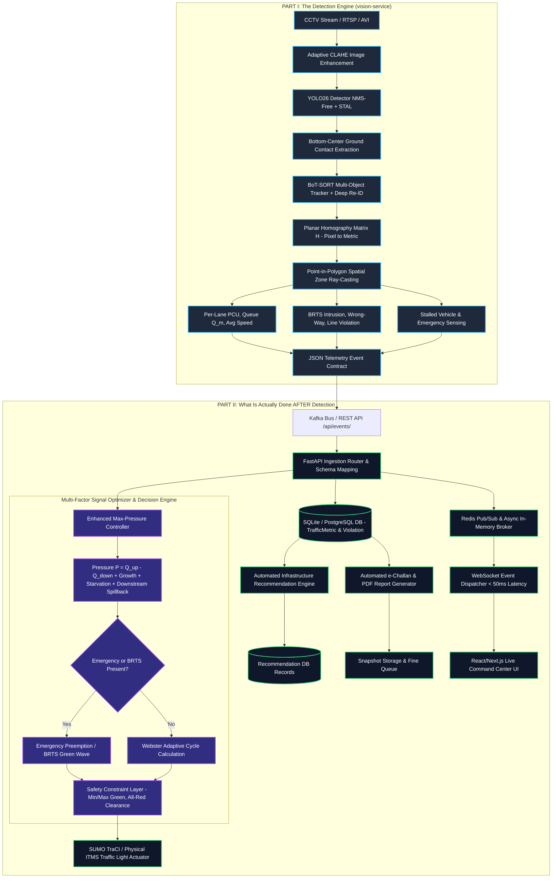

# E-Rakshak: Comprehensive End-to-End Detection & Post-Detection Action Architecture

---

## Executive Summary & System Architecture Overview

**E-Rakshak** is an AI-driven, real-time adaptive traffic management and infrastructure intelligence platform designed for complex, heterogeneous Indian traffic conditions (specifically modeled for cities like Surat).

The system operates as a closed-loop **Perception-to-Actuation** pipeline:
1. **Perception (Detection Engine)**: Ingests raw CCTV feeds, detects 7 vehicle classes with 2026-generation computer vision, tracks spatial trajectories, converts perspective pixels to real-world meters, measures queue dynamics, and flags traffic violations or emergency incidents.
2. **Action Engine (Post-Detection Pipeline)**: Ingests real-time telemetry events, logs metrics & violations to a centralized database, executes multi-factor Max-Pressure & Webster signal optimization, enforces pre-actuation safety constraints, pre-empts signals for emergency vehicles & BRTS buses, pushes live WebSocket updates to command center dashboards, generates automated e-Challans, and actuates physical traffic lights or SUMO micro-simulations.



---

# PART I: The Detection Engine (`vision-service`)

The **Detection Engine** resides within `vision-service/` and serves as the visual perception foundation of E-Rakshak. It converts raw pixel arrays into structured, metric-accurate JSON telemetry events at $30\text{ FPS}$ with sub-$12\text{ms}$ inference latency.

---

## 1. Multi-Modal Video Ingestion & Pre-Processing

- **Input Streams**: High-definition CCTV camera feeds (RTSP streams, AVI files, or IP camera feeds).
- **Adaptive Contrast Enhancement (CLAHE)**: In low-light, night, monsoon rain, or heavy dust conditions, raw camera frames suffer from poor contrast. The pipeline applies Contrast Limited Adaptive Histogram Equalization (CLAHE) in the LAB color space (luminance channel) to amplify vehicle outlines without amplifying sensor noise:
  ```python
  lab = cv2.cvtColor(frame, cv2.COLOR_BGR2LAB)
  l, a, b = cv2.split(lab)
  clahe = cv2.createCLAHE(clipLimit=2.0, tileGridSize=(8, 8))
  cl = clahe.apply(l)
  enhanced_frame = cv2.cvtColor(cv2.merge((cl, a, b)), cv2.COLOR_LAB2BGR)
  ```

---

## 2. Deep Object Detection Layer (`detector.py` — YOLO26)

### 2.1 Model Selection: Ultralytics YOLO26
E-Rakshak utilizes **YOLO26** (released Jan 2026), replacing older YOLOv8/v11 architectures due to two critical breakthroughs:
1. **NMS-Free & DFL-Free Direct Bounding Box Regression**: Eliminates Non-Maximum Suppression (NMS) post-processing. In dense Indian traffic with 150+ vehicles per frame, standard NMS causes non-deterministic CPU bottleneck spikes. YOLO26 runs with deterministic $\le 12\text{ms}$ execution times.
2. **Small-Target-Aware Labeling (STAL)**: Perspective camera views render distant vehicles at queue tails as small as $10 \times 10$ pixels. STAL explicitly optimizes loss weights for small targets, dramatically boosting recall at far approach tails.

### 2.2 7-Class Indian Traffic Taxonomy & PCU Weights
Standard COCO models fail on Indian roads. E-Rakshak uses a fine-tuned 7-class taxonomy with dedicated Passenger Car Unit (PCU) weights:

| Class ID | Class Name | Description | PCU Weight ($w_{\text{class}}$) |
| :--- | :--- | :--- | :--- |
| `0` | `car` | Sedans, hatchbacks, SUVs, vans | **1.0** |
| `1` | `bus` | Standard public and private transit buses | **3.0** |
| `2` | `brts_bus` | Dedicated BRTS Express buses (Surat livery) | **3.0** |
| `3` | `truck` | Light/heavy commercial trucks and lorries | **3.0** |
| `4` | `two_wheeler` | Motorcycles, scooters, mopeds | **0.5** |
| `5` | `auto_rickshaw` | Three-wheeler passenger & cargo rickshaws | **0.8** |
| `6` | `cycle` | Non-motorized bicycles and tricycles | **0.2** |

### 2.3 Ground Contact Point Extraction
Bounding box centroids $(x_{\text{center}}, y_{\text{center}})$ introduce severe perspective parallax errors (e.g., the roof of a tall truck appears meters behind its physical road contact location). `detector.py` extracts the **bottom-center ground contact point**:

$$x_{\text{bottom\_center}} = \frac{x_1 + x_2}{2}, \quad y_{\text{bottom\_center}} = y_2$$

This ground contact point lies directly on the road surface plane, matching planar homography geometry.

---

## 3. Multi-Object Tracking & Re-Identification (`tracker.py` — BoT-SORT)

Indian traffic exhibits extreme occlusion (e.g., motorcycles squeezed behind buses). Simple motion trackers (ByteTrack) lose continuity and double-count vehicles when they re-emerge.

E-Rakshak uses **BoT-SORT (Booster Track)**:
- **Kalman Filtering**: Predicts motion state $[x, y, s, r, \dot{x}, \dot{y}, \dot{s}]$.
- **Camera Motion Compensation (CMC)**: Employs optical flow feature tracking between frames to compensate for camera shake caused by wind or traffic vibrations.
- **Deep Re-Identification (Re-ID)**: Extracts a 128-dimensional appearance embedding vector for each bounding box. When a vehicle re-emerges after being hidden for up to 30 frames ($\approx 3\text{ seconds}$), visual cosine similarity restores the original `track_id`.

```python
@dataclass
class TrackedVehicle:
    track_id: int
    bbox: np.ndarray                      # [x1, y1, x2, y2]
    confidence: float
    class_id: int
    class_name: str
    trajectory_px: list[tuple[float, float]]     # Pixel history
    trajectory_world: list[tuple[float, float]]  # Metric world history (meters)
    lane_history: list[Optional[str]]
    frames_tracked: int = 0
    is_active: bool = True
```

---

## 4. Planar Homography Perspective-to-Metric Mapping (`calibration/homography.py`)

To convert pixel measurements to metric meters, camera geometry is calibrated using a $3 \times 3$ Planar Homography matrix $H$:

$$\begin{bmatrix} s \cdot X_{\text{meters}} \\ s \cdot Y_{\text{meters}} \\ s \end{bmatrix} = H \cdot \begin{bmatrix} x_{\text{pixel}} \\ y_{\text{pixel}} \\ 1 \end{bmatrix}$$

$$X_{\text{meters}} = \frac{s \cdot X_{\text{meters}}}{s}, \quad Y_{\text{meters}} = \frac{s \cdot Y_{\text{meters}}}{s}$$

- **Speed Estimation**: Measured via metric displacement over $N$ frames:
  $$\Delta d = \sqrt{(X_t - X_{t-k})^2 + (Y_t - Y_{t-k})^2}$$
  $$v_{\text{instant}} = \frac{\Delta d}{\Delta t} \times 3.6 \quad (\text{km/h})$$
- **Exponential Moving Average (EMA) Smoothing**:
  $$v_{\text{smooth}}(t) = \alpha \cdot v_{\text{instant}}(t) + (1 - \alpha) \cdot v_{\text{smooth}}(t - 1) \quad (\alpha = 0.3)$$

---

## 5. Spatial Zone Polygon Analytics (`zones/zone_utils.py`)

Lane boundaries and dedicated corridors are defined as multi-vertex polygons in world space. `zone_utils.py` uses OpenCV ray-casting point-in-polygon testing (`cv2.pointPolygonTest`) to compute real-time lane metrics:

1. **Vehicle Count ($N$)**: Count of unique active tracked vehicles inside the polygon.
2. **PCU-Weighted Density ($\text{PCU}_{\text{lane}}$)**:
   $$\text{PCU}_{\text{lane}} = \sum_{i \in \text{Lane}} w_{\text{class}(i)}$$
3. **Queue Length ($Q_m$)**: Metric distance from the intersection stop line to the furthest stationary vehicle ($v < 5\text{ km/h}$) inside the approach zone polygon:
   $$Q_m = \max_{v \in \text{Stationary}} \text{EuclideanDistance}(\text{StopLine}, \text{Position}_v)$$
4. **Average Lane Speed**: Arithmetic mean speed of active vehicles in the zone.

---

## 6. Violation & Incident Sensing Sub-Engines (`violations.py` & `incidents.py`)

| Sensing Engine | Trigger Condition | Rule & Threshold | Generated Output |
| :--- | :--- | :--- | :--- |
| **BRTS Corridor Intrusion** | Private vehicle inside BRTS bus lane polygon | `class_name != 'brts_bus'` AND `time_in_zone >= 3.0s` | `violation_type: "BRTS_INTRUSION"`, `track_id`, snapshot image path, vehicle class |
| **Wrong-Way Motion** | Vehicle driving counter to traffic flow | Vector dot product $\vec{v}_{\text{motion}} \cdot \vec{v}_{\text{lane}} < 0$ | `violation_type: "WRONG_WAY"`, `track_id`, timestamp |
| **Illegal Lane Change** | Vehicle crossing solid boundary polylines | Trajectory crosses illegal boundary segment | `violation_type: "LANE_DISCIPLINE"`, `track_id` |
| **Stalled Breakdown** | Vehicle stopped in active travel lane during GREEN phase | Speed $< 2\text{ km/h}$ for $> 45.0\text{s}$ while phase is GREEN | `stall_alert: {lane_id, duration_sec, throughput_loss}` |
| **Emergency Vehicle Sensing** | Ambulance / Fire Truck detected approaching | YOLO26 `ambulance`/`fire_truck` detection OR optical flashing beacon heuristic | `emergency_vehicle: {detected: True, approach: "North", lane_id: "L1"}` |
| **BRTS Approaching Sensing** | BRTS bus approaching junction | BRTS bus tracked $150–200\text{m}$ upstream | `brts_event: {brts_waiting: True, approach: "East", wait_time_sec}` |

---

## 7. Telemetry Serialization & Event Payload (`event_publisher.py`)

`event_publisher.py` packages all frame detections into the standardized E-Rakshak telemetry JSON payload contract:

```json
{
  "junction_id": "junction_01",
  "timestamp": "2026-10-08T20:18:00Z",
  "lighting_condition": "DAYLIGHT",
  "lanes": [
    {
      "lane_id": "lane_1",
      "vehicle_count": 14,
      "pcu_count": 18.5,
      "queue_length_m": 42.0,
      "avg_speed_kmph": 18.2
    },
    {
      "lane_id": "lane_2",
      "vehicle_count": 8,
      "pcu_count": 9.0,
      "queue_length_m": 21.5,
      "avg_speed_kmph": 28.4
    }
  ],
  "brts_violation": true,
  "lane_intrusion": {
    "vehicle_class": "car",
    "track_id": 402,
    "duration_sec": 4.2
  },
  "emergency_vehicle": {
    "detected": true,
    "approach": "North",
    "lane_id": "lane_1"
  },
  "stall_alert": null
}
```

---

# PART II: What Is Actually Done AFTER Detection

Once `vision-service` publishes JSON telemetry events, the **Post-Detection Action Engine** takes control. The post-detection workflow executes across four synchronized backend layers:

```
[Vision Telemetry Event] 
       │
       ▼
┌────────────────────────────────────────────────────────┐
│ Layer 1: Ingestion, Database Logging & Event Bus Broker│
└──────────────────────┬─────────────────────────────────┘
                       │
       ┌───────────────┼─────────────────┐
       ▼               ▼                 ▼
┌──────────────┐ ┌───────────┐ ┌───────────────────┐
│   Layer 2:   │ │ Layer 3:  │ │     Layer 4:      │
│   Adaptive   │ │ Infr. Rec │ │ Violation Fines & │
│  Signal Ctrl │ │   Engine  │ │ PDF Report Gen    │
└──────┬───────┘ └───────────┘ └───────────────────┘
       │
       ▼
┌────────────────────────────────────────────────────────┐
│ Layer 5: Dashboard WebSockets & Physical Light Actuation│
└────────────────────────────────────────────────────────┘
```

---

## 1. High-Throughput Event Ingestion & Message Bus Routing (`backend-api`)

### 1.1 Ingestion & ID Normalization (`app/routers_events.py`)
- The JSON payload is posted to FastAPI endpoint `POST /api/events/` or consumed directly from Kafka topic `junction-telemetry`.
- **ID Mapper**: Converts generic vision IDs (`junction_01`, `lane_1`) to canonical database keys (`J001`, `L001`). If a junction or lane does not exist in DB, it is dynamically registered.

### 1.2 Relational Database Storage (`app/db.py` & `models.py`)
Every vision event is written to persistent SQLite/PostgreSQL storage:
- **`TrafficMetric` Table**: Stores timestamp, `lane_id`, `vehicle_count`, `queue_length_m`, `occupancy_ratio` ($\min(1.0, Q_m / 120.0)$), and `average_speed_kmh`.
- **`Violation` Table**: On `brts_violation = True`, records timestamp, `lane_id`, `violation_type`, `vehicle_type`, and high-resolution JPEG snapshot storage path (`/snapshots/vision_car_1712589200.jpg`).

### 1.3 Event Bus Publishing (`app/event_bus.py`)
- `EventBus` broadcasts telemetry events via **Redis Pub/Sub** (or in-memory async queue fallback).
- Channels:
  - `traffic_live_events`: Broadcasts live junction metrics and violation popups to WebSocket clients.
  - `junction_telemetry`: Feeds real-time inputs into the `signal-optimizer`.

---

## 2. Multi-Factor Adaptive Signal Optimization (`signal-optimizer/max_pressure.py`)

The signal controller evaluates live queue metrics to dynamically calculate green phase allocations instead of relying on outdated fixed timers.

### 2.1 Multi-Factor Max-Pressure Algorithm
Standard Max-Pressure evaluates raw queue differences between upstream and downstream lanes. E-Rakshak enhances this with **6 multi-factor modifiers**:

$$P_{\text{phase}} = \left( Q_{\text{upstream}} - Q_{\text{downstream}} \right) + \text{GrowthBonus} + \text{FairnessBonus} - \text{SwitchingPenalty} - \text{SpillbackPenalty}$$

#### Modifiers Breakdown:
1. **Queue Growth Rate & Acceleration Bonus**:
   $$\text{GrowthBonus} = w_g \cdot \frac{\Delta Q}{\Delta t} + w_a \cdot \frac{\Delta^2 Q}{\Delta t^2}$$
   Prevents rapid queue explosions during sudden traffic bursts.
2. **Phase Starvation Prevention & Fairness Guarantee**:
   $$\text{FairnessBonus} = w_f \cdot \left( t_{\text{wait, red}} \right)^2$$
   Applies an exponentially increasing priority boost to red phases that have been waiting, ensuring no minor approach suffers infinite red holds.
3. **Switching Cost & Hysteresis Penalty**:
   $$\text{SwitchingPenalty} = \begin{cases} C_{\text{switch}}, & \text{if phase changes} \\ 0, & \text{if current phase continues} \end{cases}$$
   Prevents signal thrashing (unnecessary yellow/red switching when queue pressures are nearly identical).
4. **Downstream Congestion & Spillback Protection**:
   If downstream receiving lanes exceed $85\%$ capacity, $\text{SpillbackPenalty}$ drastically reduces upstream green allocation to prevent gridlocking the interior box.
5. **Demand-Responsive Green Duration ($G_{\text{adaptive}}$)**:
   Calculates green hold duration dynamically based on queue length:
   $$G_{\text{adaptive}} = \text{clamp}\left( G_{\text{min}} + k \cdot Q_{\text{upstream}}, G_{\text{min}}, G_{\text{max}} \right) \quad (G_{\text{min}}=10\text{s}, G_{\text{max}}=90\text{s})$$
6. **Webster Optimal Master Cycle Calculation (`webster_formula.py`)**:
   Periodically adjusts total junction cycle length $C_0$ based on critical flow ratio $Y = \sum y_i$:
   $$C_0 = \frac{1.5 L + 5}{1 - Y}$$
   where $L$ is total lost time per cycle (yellow + all-red clearance).

---

## 3. Emergency & Transit Priority Preemption System (`signal-optimizer/priority.py`)

When critical events occur, the controller overrides normal Max-Pressure logic:

```
                      [ Telemetry Event Ingested ]
                                   │
                    ┌──────────────┴──────────────┐
                    ▼                             ▼
       [ emergency_vehicle.detected? ]    [ brts_bus.waiting? ]
                    │                             │
            ┌───────┴───────┐             ┌───────┴───────┐
            │ YES           │ NO          │ YES           │ NO
            ▼               ▼             ▼               ▼
      【 EMERGENCY 】  (Continue)   【 BRTS BOOST 】 (Standard
      - Highest Rank                - Continuous     Max-Pressure)
      - Immediate Green                Pressure Boost
      - Preempt Cycle               - Green Extension
      - Recovery Phase                 or Red Truncation
```

### 3.1 Emergency Vehicle Priority (Highest Rank)
- **Immediate Cycle Interruption**: When `emergency_vehicle.detected = true`, standard Max-Pressure is suspended immediately.
- **Green Corridor Activation**: Grants instant GREEN phase to the emergency vehicle's approach direction.
- **Hold Duration**: Holds green phase for $15.0\text{ seconds}$ (or until vehicle clears the exit homography zone).
- **Smooth Recovery Phasing**: After emergency vehicle passes, the controller executes a calculated recovery cycle to clear accumulated residual queues on cross-streets without causing secondary gridlock.

### 3.2 BRTS Green Wave / Priority Boost (`green_wave.py`)
- **Continuous Smooth Ramp**: When a BRTS bus is sensed $150–200\text{m}$ upstream, a continuous sigmoid-like pressure multiplier is applied to the BRTS corridor phase:
  $$\text{Bonus} = \text{SmoothStep}\left( t_{\text{wait}}, t_{\text{start}}=5\text{s}, t_{\text{full}}=20\text{s} \right) \times \text{MaxBonus}$$
- **Green Extension / Red Truncation**: If the BRTS phase is currently active, green time is extended. If red, the cross-phase is safely truncated to give green right as the bus reaches the stop line.

---

## 4. Pre-Actuation Safety Constraint Layer (`signal-optimizer/safety.py`)

No optimization decision reaches the physical traffic light without passing through `SafetyValidator`. This pre-actuation layer enforces non-negotiable safety rules:

```python
class SafetyValidator:
    def validate(self, proposed_phase: str, proposed_cycle_sec: int, emergency_override: bool = False) -> SafetyCheckResult:
        # Rule 1: Emergency override passthrough
        if emergency_override:
            return SafetyCheckResult(is_safe=True, validated_phase=proposed_phase)
            
        # Rule 2: Minimum Green Lock (Phase Lock Protection)
        if proposed_phase != self._current_phase and self._green_elapsed < cfg.min_green_lock_sec:
            # Block switch! Keep current phase active
            return SafetyCheckResult(is_safe=False, validated_phase=self._current_phase)
            
        # Rule 3: Duration Bounds Clamping
        validated_cycle = max(cfg.min_cycle_sec, min(cfg.max_cycle_sec, proposed_cycle_sec))
        
        # Rule 4: Clearance Timing (3s Yellow + 2s All-Red)
        # Enforced by TraCI / Traffic Controller runner
        return SafetyCheckResult(is_safe=True, validated_phase=proposed_phase, validated_cycle_sec=validated_cycle)
```

---

## 5. Automated Infrastructure Recommendations Engine (`backend-api/app/recommendations.py`)

Beyond real-time signal changes, the post-detection pipeline analyzes aggregated database trends ($>30\text{-minute}$ sliding windows) to generate permanent urban infrastructure recommendations:

```
[ Aggregated DB Metrics ] ──► [ Recommendation Engine ] ──► [ Write to DB ] ──► [ Command Center UI ]
```

### Automated Rules & Actions:
1. **Left-Turn Bottleneck Detection**: If left-turn lane queue $Q_m > 85\text{m}$ for $>45\text{ mins}$, generates:
   - *Issue*: Severe Left-Turn Spillback at J001.
   - *Action*: Construct dedicated left-turn pocket or add dedicated left-arrow signal phase.
2. **BRTS Corridor Encroachment Alert**: If BRTS intrusion violations exceed 15 incidents/hour:
   - *Issue*: Frequent BRTS Corridor Encroachment.
   - *Action*: Install bollards/raised physical curbs at approach.
3. **Signal Mode Toggle Recommendation**: If traffic volume drops below threshold (night mode):
   - *Action*: Automatically recommend switching from Adaptive Max-Pressure to Flashing Amber / Night Fixed mode.

---

## 6. Automated Violation Management & Fine Generation (`app/report_generator.py`)

When `violations.py` detects a BRTS intrusion, wrong-way movement, or lane discipline violation:

1. **Snapshot Storage**: High-resolution camera frame with bounding box overlay is saved to static storage (`/snapshots/vision_car_1712589200.jpg`).
2. **Database Logging**: Violation record with timestamp, junction ID, lane ID, vehicle class, and image URL is committed.
3. **e-Challan Fine Payload Creation**: Sends fine ticket event payload containing vehicle class, snapshot URL, location, and penalty amount.
4. **PDF Incident Report Generator (`report_generator.py`)**: Automatically compiles hourly and daily executive traffic PDF reports featuring violation analytics, congestion hot-spots, and adaptive vs fixed delay savings graphs.

---

## 7. Real-Time Command Center Dashboard (`dashboard/` & `frontend/`)

The web UI provides real-time situational awareness for traffic operators:

- **WebSocket Live Stream ($<50\text{ms}$ Latency)**: `event_bus.py` pushes real-time junction updates (`junction_update`, `new_violation`).
- **Interactive Map View**:
  - Live junctions labeled with signal status (Green/Yellow/Red), current mode (Adaptive vs Fixed), and queue lengths.
  - Active countdown timers showing remaining phase green seconds.
- **Violation Snapshot Modal**: Live popups when BRTS intrusions occur, displaying captured camera snapshot images.
- **Manual Police Override**: Traffic operators can push a UI button to manually toggle junction mode between **Adaptive** and **Fixed** or trigger emergency green corridors manually.

---

## 8. Physical Light Actuation & SUMO Micro-Simulation Loop

Finally, the validated signal decision is actuated:

- **Physical Intersection Hardware**: Communicates via NEMA TS2 or ITMS RS-485/IP controller protocols to switch physical signal lamps.
- **SUMO Micro-Simulation Bridge (`scripts/run_sumo_simulation.py`)**: Uses Eclipse SUMO TraCI Python API to actuate simulated traffic signals in real-time:
  ```python
  traci.trafficlight.setPhase("J001", target_phase_index)
  traci.trafficlight.setPhaseDuration("J001", validated_cycle_sec)
  ```

---

# PART III: End-to-End Failure Modes & Resilience Matrix

| Failure Mode | Root Cause | Perception Mitigation (`vision-service`) | Post-Detection Action Mitigation (`signal-optimizer` / `backend`) |
| :--- | :--- | :--- | :--- |
| **Vision Service Crash / Network Drop** | Camera disconnect, power failure, or process crash | Sensor heartbeats sent every 2 seconds via `health.py`. | Controller detects missing telemetry and automatically falls back to **Historical Time-of-Day Profile** or **Webster Fixed-Timer Mode**. |
| **Heavy Night Headlight Glare / Rain** | Water droplets or glare obscuring lane markers | Adaptive CLAHE preprocessing + confidence thresholding (`confidence.py`). | Lower confidence scores widen safety margins ($G_{\text{min}}$ boosted, cycle variations capped). |
| **Severe Occlusion (Bus hiding car)** | Vehicle hidden from camera view | BoT-SORT 128-D Deep Re-ID embeddings maintain Track ID for up to 30 frames. | Downstream queue predictor interpolates missing count from upstream flow rate. |
| **Database Write Lock / Latency Spike** | High write concurrency on DB | Ingest router buffers metrics asynchronously in memory. | `event_bus.py` bypasses DB for WebSocket real-time signal actuation, ensuring zero delay in light switches. |
| **Conflicting Priority Requests** | Ambulance on North approach AND Ambulance on East approach simultaneously | Vision publishes dual emergency alerts with metric approach distances. | `priority.py` ranks requests by distance/ETA and serves closer ambulance first while preparing downstream green wave. |

---

# Summary Table: Perception vs Action Capabilities

```
+───────────────────────────────────────────────+───────────────────────────────────────────────+
│         PERCEPTION (Detection Part)           │        ACTION (What is Done AFTER)            │
+───────────────────────────────────────────────+───────────────────────────────────────────────+
│ • YOLO26 NMS-Free Vehicle Detection (7 Classes)│ • FastAPI Ingestion & Relay (<50ms Latency)   │
│ • Bottom-Center Ground Contact Extraction     │ • Database Storage (TrafficMetric & Violation)│
│ • BoT-SORT Tracking + Deep Re-ID (128-D)      │ • Multi-Factor Max-Pressure Signal Control    │
│ • Planar Homography Pixel-to-Meter Mapping    │ • Emergency Vehicle Preemption Override       │
│ • Point-in-Polygon Per-Lane PCU & Queue Calc  │ • BRTS Green Wave Continuous Signal Boost     │
│ • BRTS Intrusion & Wrong-Way Violation Rules  │ • Safety Validation (Min/Max Green Lock)      │
│ • Stalled Vehicle & Emergency Sensing         │ • Automated Infrastructure Recommendations    │
│ • Standardized JSON Telemetry Serialization    │ • Automated e-Challan & PDF Report Generation │
│                                               │ • Real-time WebSocket Dashboard Streaming     │
│                                               │ • Physical Traffic Light / SUMO Actuation     │
+───────────────────────────────────────────────+───────────────────────────────────────────────+
```

---
*E-Rakshak Comprehensive Detection & Post-Detection System Manual — 2026*
