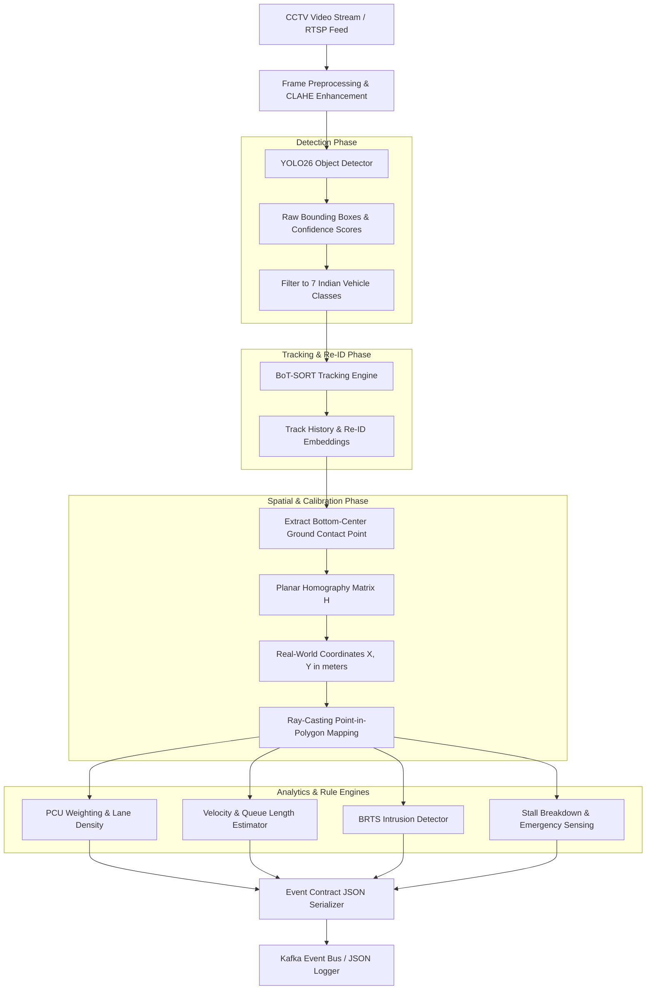

# E-Rakshak Computer Vision Sensing Layer
## Deep-Dive Technical Specification & Engineering Manual

---

## Executive Summary

The **Computer Vision Sensing Layer (`vision-service`)** serves as the primary perceptual subsystem of the E-Rakshak Intelligent Transportation System. Its sole operational directive is to ingest real-time CCTV video streams (RTSP / AVI) from urban intersections and convert raw pixel data into high-fidelity, structured JSON telemetry events.

Designed specifically for the heterogeneous, high-density, non-lane-disciplined traffic of Indian cities, the vision service incorporates state-of-the-art computer vision models released in 2026:
- **YOLO26**: Ultralytics' latest NMS-free object detector with Small-Target-Aware Labeling (STAL).
- **BoT-SORT**: Booster Multi-Object Tracker combining motion prediction with appearance re-identification (Re-ID).
- **SAM 3.1**: Meta's Segment Anything Model for zero-shot text-prompted auto-labeling.
- **Planar Homography**: Perspective-to-metric geometric projection transforming 2D pixels to real-world meters.
- **Spatial Zone Geometry**: Polygon-based spatial partitioning for per-lane Passenger Car Unit (PCU) counting, queue length measurement, BRTS corridor intrusion detection, and incident sensing.

---

## Table of Contents

1. [Subsystem Architecture & Pipeline Flow](#1-subsystem-architecture--pipeline-flow)
2. [Detector Layer (`detector.py` — YOLO26)](#2-detector-layer-detectorpy--yolo26)
3. [Multi-Object Tracking Layer (`tracker.py` — BoT-SORT)](#3-multi-object-tracking-layer-trackerpy--bot-sort)
4. [Geometric Calibration & Homography (`calibration/homography.py`)](#4-geometric-calibration--homography-calibrationhomographypy)
5. [Spatial Zone Mapping & PCU Analytics (`zones/zone_utils.py`)](#5-spatial-zone-mapping--pcu-analytics-zoneszone_utilspy)
6. [Violation Sensing Engine (`violations.py`)](#6-violation-sensing-engine-violationspy)
7. [Incident & Anomaly Sensing Engine (`incidents.py`)](#7-incident--anomaly-sensing-engine-incidentspy)
8. [Synthetic Data Pipeline & Auto-Labeling (`data_pipeline/`)](#8-synthetic-data-pipeline--auto-labeling-data_pipeline)
9. [Telemetry Event Publisher (`event_publisher.py`)](#9-telemetry-event-publisher-event_publisherpy)
10. [Visual Pipeline Diagnostic Tool (`visualize_pipeline.py`)](#10-visual-pipeline-diagnostic-tool-visualize_pipelinepy)
11. [Edge Case Handling & Performance Mitigations](#11-edge-case-handling--performance-mitigations)

---

## 1. Subsystem Architecture & Pipeline Flow

The vision pipeline processes incoming video frames through a sequential multi-stage transformation:



---

## 2. Detector Layer (`detector.py` — YOLO26)

### 2.1 Model Selection Rationale: Why YOLO26?
Previous traffic vision systems relied on YOLOv8 or YOLOv11. E-Rakshak utilizes **YOLO26** (Ultralytics, Jan 2026) due to two major architectural advancements:

1. **NMS-Free & DFL-Free Architecture**:
   Traditional detectors rely on Non-Maximum Suppression (NMS) during post-processing, which introduces variable, non-deterministic CPU latency when handling hundreds of closely packed vehicles. YOLO26 eliminates NMS by employing end-to-end direct bounding box regression, delivering deterministic $\le 12\text{ms}$ inference frame times.

2. **Small-Target-Aware Label Assignment (STAL)**:
   In perspective camera views, vehicles at the far end of an approach appear extremely small ($10 \times 10$ pixels). Standard detectors undercount these distant vehicles, causing severe underestimation of queue lengths. STAL explicitly optimizes loss weights for small targets, preserving high recall at queue tails.

---

### 2.2 Target Class Mapping
Stock COCO models lack representation for common Indian traffic components. E-Rakshak fine-tunes YOLO26 on a custom 7-class taxonomy:

| Class ID | Class Name | Description | PCU Weight |
| :--- | :--- | :--- | :--- |
| `0` | `car` | Sedans, hatchbacks, SUVs, vans | 1.0 |
| `1` | `bus` | Standard public and private transit buses | 3.0 |
| `2` | `brts_bus` | Surat BRTS Express buses (distinct livery/shape) | 3.0 |
| `3` | `truck` | Light/heavy commercial trucks, lorries | 3.0 |
| `4` | `two_wheeler` | Motorcycles, scooters, mopeds | 0.5 |
| `5` | `auto_rickshaw` | Three-wheeler passenger & cargo rickshaws | 0.8 |
| `6` | `cycle` | Bicycles, tricycles | 0.2 |

> **Fallback Mode**: When running with stock pretrained COCO weights before fine-tuning, `detector.py` executes a lossy remapping (`COCO_TO_CUSTOM`) mapping COCO IDs `1, 2, 3, 5, 7` to custom classes, while issuing a warning to fine-tune.

---

### 2.3 Ground Contact Point Extraction
Bounding box centroids $(x_{\text{center}}, y_{\text{center}})$ introduce severe projection errors when mapped to 3D world space because vehicle height creates a perspective parallax offset (e.g., the roof of a tall truck appears far behind its actual road surface location).

To eliminate this error, `detector.py` extracts the **bottom-center ground contact point**:

$$x_{\text{bottom\_center}} = \frac{x_1 + x_2}{2}$$

$$y_{\text{bottom\_center}} = y_2$$

This point rests directly on the road surface plane, providing exact alignment with planar homography calibration.

```python
@property
def bottom_center(self) -> tuple[float, float]:
    """Ground-contact point: bottom-center of bounding box."""
    x_center = (self.bbox[0] + self.bbox[2]) / 2.0
    y_bottom = self.bbox[3]
    return (float(x_center), float(y_bottom))
```

---

## 3. Multi-Object Tracking Layer (`tracker.py` — BoT-SORT)

### 3.1 Why BoT-SORT over ByteTrack?
Indian traffic exhibits high density with constant visual occlusion—such as two-wheelers and auto-rickshaws squeezing between or behind large buses.

- **ByteTrack**: Uses motion prediction (Kalman filtering) exclusively. When an auto-rickshaw is hidden behind a bus for 2 seconds, ByteTrack loses track continuity and assigns a brand-new Track ID upon re-emergence, causing artificial vehicle count inflation.
- **BoT-SORT (Booster Track)**: Integrates appearance Deep Re-Identification (Re-ID) embeddings alongside Kalman motion state and Camera Motion Compensation (CMC). When a vehicle re-emerges from behind an obstruction, BoT-SORT compares visual embeddings to restore the original Track ID.

---

### 3.2 Dataclass & State Preservation (`TrackedVehicle`)
Each active vehicle track maintains state history over time:

```python
@dataclass
class TrackedVehicle:
    track_id: int
    bbox: np.ndarray                      # Current [x1, y1, x2, y2]
    confidence: float
    class_id: int
    class_name: str
    trajectory_px: list[tuple[float, float]]     # Pixel position history
    trajectory_world: list[tuple[float, float]]  # Metric world position history
    lane_history: list[Optional[str]]            # Lane assignment trajectory
    frames_tracked: int = 0
    is_active: bool = True
```

Trajectory history is capped at `MAX_TRAJECTORY_LENGTH = 300` frames ($\approx 30\text{ seconds}$ at 10 FPS) to prevent memory growth.

---

## 4. Geometric Calibration & Homography (`calibration/homography.py`)

### 4.1 Planar Homography Transformation Matrix
Camera pixels are projected to real-world ground plane coordinates in meters using a $3 \times 3$ transformation matrix $H$:

$$\begin{bmatrix} s \cdot X_{\text{meters}} \\ s \cdot Y_{\text{meters}} \\ s \end{bmatrix} = H \cdot \begin{bmatrix} x_{\text{pixel}} \\ y_{\text{pixel}} \\ 1 \end{bmatrix}$$

$$X_{\text{meters}} = \frac{s \cdot X_{\text{meters}}}{s}, \quad Y_{\text{meters}} = \frac{s \cdot Y_{\text{meters}}}{s}$$

`calibration/homography.py` computes $H$ using OpenCV's `cv2.findHomography()` from 4 manual reference points (e.g. lane width markings measured on-site in meters):

```python
H, _ = cv2.findHomography(pixel_pts, world_pts, cv2.RANSAC)
```

---

### 4.2 Speed Computation & Moving Average Smoothing
Vehicle speed is computed by measuring real-world metric distance displacement $\Delta d$ across a sliding window of $N$ frames:

$$\Delta d = \sqrt{(X_t - X_{t-k})^2 + (Y_t - Y_{t-k})^2}$$

$$v_{\text{instant}} = \frac{\Delta d}{\Delta t} \times 3.6 \quad (\text{km/h})$$

To eliminate frame jitter, speed estimates are smoothed using an Exponential Moving Average (EMA) with $\alpha = 0.3$:

$$v_{\text{smooth}}(t) = \alpha \cdot v_{\text{instant}}(t) + (1 - \alpha) \cdot v_{\text{smooth}}(t - 1)$$

---

## 5. Spatial Zone Mapping & PCU Analytics (`zones/zone_utils.py`)

### 5.1 Polygon Zone Geometry
Zones are configured in `zones/zone_config.yaml` as normalized or pixel coordinate polygons representing:
- Upstream directional lanes (`lane_NS_1`, `lane_NS_2`, `lane_EW_1`, `lane_EW_2`)
- Downstream receiving lanes
- Dedicated BRTS corridor (`brts_lane_polygon`)

```yaml
zones:
  lane_NS_1:
    polygon: [[320, 400], [480, 400], [520, 720], [280, 720]]
    approach: "NS"
    stop_line_y: 420
```

---

### 5.2 Point-in-Polygon Ray Casting
To determine which lane a vehicle occupies, `zone_utils.py` executes `cv2.pointPolygonTest()` using the vehicle's bottom-center coordinate:

$$\text{inside} = \text{cv2.pointPolygonTest}(\text{polygon\_pts}, (x_{\text{bottom}}, y_{\text{bottom}}), \text{measureDist}=\text{False}) \ge 0$$

---

### 5.3 Per-Lane Analytics Calculation
For each configured lane zone, `zone_utils.py` aggregates:

1. **Raw Vehicle Count** ($N$): Number of distinct `TrackedVehicle` instances inside the polygon.
2. **PCU-Weighted Count**:
   $$\text{PCU}_{\text{lane}} = \sum_{v \in \text{Lane}} w_{\text{class}(v)}$$
3. **Queue Length Estimation ($Q_m$)**:
   Distance in meters from the intersection stop-line to the farthest stationary vehicle ($v < 5\text{ km/h}$) inside the lane polygon:
   $$Q_m = \max_{v \in \text{Stationary}} \text{EuclideanDistance}(\text{StopLine}, \text{Position}_v)$$
4. **Average Lane Speed**:
   Arithmetic mean speed of all active vehicles within the lane polygon.

---

## 6. Violation Sensing Engine (`violations.py`)

### 6.1 BRTS Corridor Intrusion Sensing
Surat features dedicated Bus Rapid Transit System (BRTS) corridors that must remain clear of private traffic.

- **Detection Rule**:
  1. Evaluate vehicles inside `brts_lane_polygon`.
  2. If `class_name != 'brts_bus'`, increment vehicle's `brts_occupancy_timer`.
  3. If `brts_occupancy_timer >= 3.0 seconds`, trigger a formal **BRTS Lane Intrusion Violation Event**.
- **Output Data**: `violation_type: "BRTS_INTRUSION"`, `vehicle_class`, `track_id`, `snapshot_frame`, `duration_sec`.

---

### 6.2 Lane Discipline & Wrong-Way Driving
- **Illegal Turn Detection**: Tracks trajectory points across lane boundary polylines. If a vehicle crosses a solid white line or turns left from a right-turn-only lane, a violation alert is generated.
- **Wrong-Way Motion**: Evaluates the dot product between vehicle motion vector $\vec{v}_{\text{motion}}$ and expected lane direction vector $\vec{v}_{\text{lane}}$. If $\vec{v}_{\text{motion}} \cdot \vec{v}_{\text{lane}} < 0$, a wrong-way violation is flagged.

---

## 7. Incident & Anomaly Sensing Engine (`incidents.py`)

### 7.1 Stalled Vehicle / Breakdown Detection
A stalled vehicle in an active lane severely degrades throughput and can cause secondary accidents.

- **Detection Condition**:
  - Vehicle position remains within $\pm 0.5\text{ meters}$ for $> 45\text{ seconds}$.
  - Current signal phase for the approach is **GREEN** (ruling out normal traffic light waiting).
- **Trigger**: Emits `stall_alert` JSON containing `lane_id`, `duration_sec`, and estimated throughput loss.

---

### 7.2 Emergency Vehicle Sensing
Ambulances, fire engines, and police response vehicles require immediate signal preemption.

- **Detection Methods**:
  1. Fine-tuned YOLO26 class detection (`ambulance`, `fire_truck`).
  2. Flashing beacon light pattern heuristics (analyzing high-frequency color variations in red/blue/white bounding box regions).
- **Behavior**: Publishes an immediate high-priority alert payload specifying `emergency_vehicle.detected = true`, approach direction, and lane location.

---

### 7.3 BRTS Bus Approaching Sensing
Detects BRTS buses approaching the intersection from $150–200\text{ meters}$ away, providing early notification to the `signal-optimizer` to extend or initiate green phase before the bus comes to a complete stop.

---

## 8. Synthetic Data Pipeline & Auto-Labeling (`data_pipeline/`)

To quickly fine-tune YOLO26 on local Surat traffic footage without manual labeling, E-Rakshak includes an automated data pipeline:

```mermaid
flowchart LR
    RawVideo[Raw CCTV Video AVI] --> AutoLabel[auto_label.py via SAM 3.1]
    AutoLabel --> DraftLabels[Draft YOLO Label Files]
    DraftLabels --> ReviewHelpers[review_helpers.py Frame Sampler]
    ReviewHelpers --> Roboflow[Roboflow Web Editor Verification]
    Roboflow --> CorrectedLabels[Corrected Dataset]
    CorrectedLabels --> FineTune[finetune.py Training Script]
    FineTune --> ModelWeights[surat_yolo26s_finetuned.pt]
```



### Script Specifications:
1. `data_pipeline/auto_label.py`: Runs zero-shot text-prompted segmentation using Segment Anything Model 3.1 (SAM 3.1) to generate initial YOLO bounding boxes.
2. `data_pipeline/review_helpers.py`: Samples 400 diverse frames and exports them in Roboflow-compatible format for human verification.
3. `data_pipeline/finetune.py`: Trains YOLO26s for 50 epochs on corrected local data.

---

## 9. Telemetry Event Publisher (`event_publisher.py`)

`event_publisher.py` packages all detection, tracking, zone metrics, violations, and incidents into the standardized JSON event payload contract:

```python
class EventPublisher:
    """Formats and publishes telemetry JSON events to Kafka or file log."""
    
    def publish_event(self, junction_id: str, lanes_data: list, alerts: dict) -> dict:
        payload = {
            "junction_id": junction_id,
            "timestamp": datetime.utcnow().isoformat() + "Z",
            "lighting_condition": self._determine_lighting(),
            "lanes": lanes_data,
            "brts_violation": alerts.get("brts_violation", False),
            "emergency_vehicle": alerts.get("emergency_vehicle", {"detected": False}),
            "stall_alert": alerts.get("stall_alert", None)
        }
        # Write to local JSONL and send to Kafka topic 'junction-telemetry'
        self._write_to_kafka(payload)
        return payload
```

---

## 10. Visual Pipeline Diagnostic Tool (`visualize_pipeline.py`)

For debugging and pitch demonstrations, `visualize_pipeline.py` provides an annotated video overlay renderer displaying:
- Bounding boxes color-coded by class (`car`=Green, `bus`=Blue, `two_wheeler`=Yellow, `auto_rickshaw`=Orange, `brts_bus`=Purple).
- Track ID labels with motion direction vectors.
- Semi-transparent polygon overlays for directional lanes and BRTS corridor.
- Real-time overlay HUD showing per-lane PCU count, average speed, and active violation popups.

---

## 11. Edge Case Handling & Performance Mitigations

| Edge Case / Challenge | Root Cause | Engineering Mitigation |
| :--- | :--- | :--- |
| **Night & Low Light** | Low contrast, headlight glare | Adaptive CLAHE (Contrast Limited Adaptive Histogram Equalization) preprocessing applied to input frames in `main.py`. |
| **Camera Vibration / Wind** | Pole shake shifting pixel coordinates | BoT-SORT Camera Motion Compensation (CMC) using optical flow feature matching to stabilize track trajectories. |
| **Heavy Monsoon Rain** | Water droplets on lens, blurred bounds | Detection confidence threshold dynamically adjusted by `confidence.py` in downstream optimizer. |
| **Extreme Occlusion** | Auto-rickshaw hidden behind truck | BoT-SORT 128-dimensional Re-ID feature embedding matching preserves Track ID across 30-frame occlusions. |
| **Tall Vehicle Parallax** | Bus roof projected meters away | Bottom-center ground contact point $(x_{\text{center}}, y_{\text{bottom}})$ replaces bounding box centroid for homography transform. |

---
*E-Rakshak Computer Vision Sensing Layer Technical Manual — 2026*
