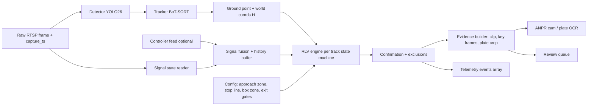
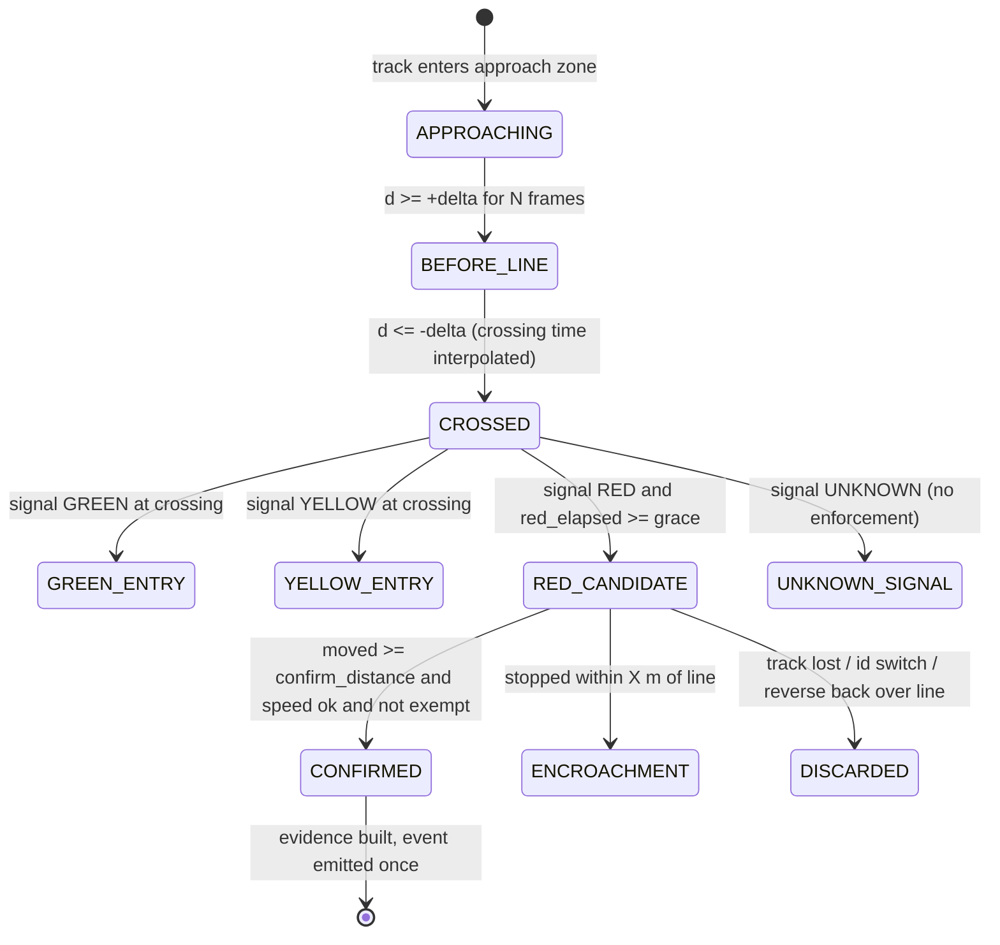
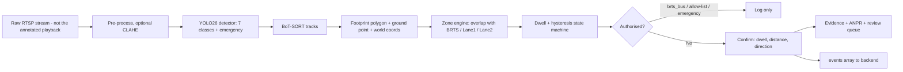

# E-Rakshak: Detailed Improvement Guide

A critique and upgrade plan for the "Comprehensive End-to-End Detection & Post-Detection Action Architecture" document.

**Priority legend**
- **P0** = wrong, unsafe, or legally blocking. Fix before anyone reviews or demos this.
- **P1** = big quality jump. Do next.
- **P2** = polish / future scope.

---

## 1. Scorecard

| Area | Score | One-line reason |
|---|---|---|
| Concept & coverage | 8.5 / 10 | Full loop from camera to signal to dashboard to enforcement. Few student projects cover this much. |
| Technical correctness & consistency | 6 / 10 | Several numbers and definitions contradict each other (see Section 2). |
| Signal-control design | 6.5 / 10 | Good ideas (fairness, spillback, priority), but Max-Pressure and Webster are mixed without a clear rule, and the stability guarantee is lost. |
| Safety & legal | 4.5 / 10 | Emergency override skips clearance; e-Challan has no plate recognition; no human review. |
| Evaluation & evidence | 2 / 10 | Latency, FPS and accuracy are stated as facts, but no measurement, dataset, baseline or metric is shown. |
| Production readiness | 4 / 10 | No security, no edge deployment plan, no monitoring, no schema versioning, dynamic registration of junctions. |
| **Overall** | **6.5 / 10** | A strong prototype-level architecture. Not yet an engineering spec you can defend under questioning. |

The single biggest upgrade: **replace claims with measurements.** Every number in the document ("<50 ms", "30 FPS", "≤12 ms", "150+ vehicles per frame") should either link to a benchmark you ran or be reworded as a target.

---

## 2. Errors and inconsistencies to fix first (P0)

| # | What the document says | Problem | Fix |
|---|---|---|---|
| 1 | Re-ID restores a track hidden for "up to 30 frames (≈3 seconds)" | At 30 FPS, 30 frames is **1 second**. 3 s would be ~90 frames. | Decide the processing FPS (see 3.2), then set `track_buffer = seconds × fps`. Write both numbers. |
| 2 | Kalman state `[x, y, s, r, ẋ, ẏ, ṡ]` | That is the SORT/ByteTrack vector (area and aspect ratio). BoT-SORT uses `[x, y, w, h, vx, vy, vw, vh]`. | Correct the state vector, or say "SORT-style". |
| 3 | 7-class taxonomy, but the incident table uses `ambulance` / `fire_truck` detections | Those classes do not exist in your model. | Add `ambulance` and `fire_truck` as classes (classes 7 and 8), or remove the claim and rely on a separate classifier plus siren/beacon logic. |
| 4 | `occupancy_ratio = min(1, Q_m / 120)` | This is a normalised queue length, not occupancy. Occupancy means fraction of time a detector is covered, or fraction of lane area/capacity used. | Rename to `queue_fill_ratio`, or compute true occupancy from zone area covered by vehicles. |
| 5 | e-Challan is generated from a BRTS intrusion | No number-plate recognition (ANPR/ALPR) anywhere in the pipeline. A challan cannot be issued without the plate. | Add the ANPR stage (Section 3.6) and a human-review step. |
| 6 | Safety rule 1: `emergency_override` returns `is_safe=True` immediately | This bypasses **everything**, including yellow and all-red clearance. Conflicting greens could appear with cars still in the box. | Emergency may shorten or truncate the minimum green, but must **never** skip clearance (Section 7 gives a replacement). |
| 7 | Both Max-Pressure and Webster decide timing | Max-Pressure is acyclic (picks the next phase); Webster is cyclic (fixes a cycle length). The document never says which one actually controls the light. | Pick one primary controller (Section 6.1). |
| 8 | Webster lost time `L` = "yellow + all-red" | Lost time per phase also includes start-up lost time minus the portion of yellow used by drivers. | Use `L = Σ (start-up loss + clearance loss)` per critical phase. Calibrate start-up loss for Indian conditions. |
| 9 | Queue = distance to the **furthest** stationary vehicle | One parked or broken-down vehicle far upstream makes the queue look huge. Also uses straight-line distance, not distance along the lane. | Use a contiguous queue definition measured along the lane centerline (code in 3.5). |
| 10 | Junctions and lanes "dynamically registered" if missing | A misconfigured or spoofed camera creates ghost junctions that feed the signal controller. | Provision junctions and lanes through an admin-controlled config. Reject unknown IDs. |
| 11 | PCU weights bus/truck = 3.0, auto = 0.8, cycle = 0.2 | These do not match published Indian guidance exactly, and PCU varies with road width and traffic composition. | Compare against the IRC:106 tables, cite the source, or calibrate from your own Surat saturation-flow data. |
| 12 | YOLO26 "released Jan 2026", "deterministic ≤12 ms", "150+ vehicles per frame" | The model features you describe (NMS-free, no DFL, small-target-aware labelling) match what Ultralytics publishes, but latency depends entirely on your hardware, resolution and precision. | Quote the Ultralytics source for features. Quote **your own** benchmark for latency. |
| 13 | Telemetry has one top-level `brts_violation` boolean and one `lane_intrusion` object | Cannot represent two violations in the same frame. | Use an `events[]` array (Section 4). |

---

## 3. Perception improvements

### 3.1 Data and training (P0/P1)

The document assumes a fine-tuned 7-class Indian model but says nothing about data. A model is only as good as its dataset.

1. **Dataset plan**
   - Collect Surat footage across: day, dusk, night, rain, glare, dust, festival crowds, different camera heights.
   - Start from a public Indian dataset (for example the India Driving Dataset) for pretraining, then fine-tune on your own labelled frames.
   - Label at least a few thousand frames per condition. Track counts **per class** and **per condition** in a table.
2. **Class imbalance**: `brts_bus`, `ambulance`, `fire_truck`, `cycle` will be rare. Use targeted collection, copy-paste augmentation, or class-weighted loss.
3. **Hard-case set**: build a fixed "golden" test set (never trained on) with occlusion, night and rain frames. Report results on it every time you retrain.
4. **Small objects**: far queue tails at 10×10 px are hard. Test input sizes (for example 960 vs 1280) and tiling/slicing inference (SAHI-style) on the far approach only, and measure the recall gain against the latency cost.
5. **Privacy at the source**: do not keep raw training footage longer than needed. Blur faces if frames are used outside enforcement.

### 3.2 Inference and deployment (P1)

- **Process at the FPS you need, not the FPS the camera gives.** Counting, queue and speed work well at 10–15 FPS. Running at 30 FPS doubles compute for little gain. Pick one number and derive every frame-based constant from it (tracker buffer, speed window, stall timer).
- **Run on the edge.** Detection + tracking on a roadside GPU box (for example an NVIDIA Jetson-class device), export to TensorRT (FP16, then INT8 after checking accuracy loss), send **telemetry only** to the server. Streaming raw video to a central server does not scale across many junctions.
- **Latency budget table.** Replace the single "<50 ms" with a measured budget:

  | Stage | Target | Measured |
  |---|---|---|
  | Capture + decode | | |
  | Preprocess (CLAHE etc.) | | |
  | Detection | | |
  | Tracking + Re-ID | | |
  | Zone metrics | | |
  | Publish | | |
  | Broker + ingest | | |
  | Controller decision | | |
  | **End to end** | | |

  Note that a signal controller decides every few seconds. Millisecond latency matters for the dashboard, not for the light. Say so.
- **Time sync**: use NTP (or PTP) on all edge devices and carry both `capture_ts` and `publish_ts` so you can measure real delay.

### 3.3 Tracking (P1)

- Fixed CCTV rarely needs camera-motion compensation. Keep it as an option, but benchmark with it **off**. It costs compute.
- Check whether Re-ID is actually enabled in your tracker configuration. In many trackers it is off by default.
- Two-wheelers are tiny and often merge with riders and pillion passengers. Evaluate ID switches **per class**.
- Add a track-quality score (age, detection confidence history). Only count a vehicle in a metric after it has lived for a minimum number of frames. This removes flicker from false positives.
- Report tracker quality with HOTA, IDF1 and ID switches on your own labelled clips (Section 8.3).

### 3.4 Calibration and speed (P1)

- **Homography accuracy drops with distance.** One pixel at the far end can be metres. Report error versus distance.
- **Validate** with surveyed points: measure real distances on the road (tape or GPS), project them, and report the error in metres.
- **Calibrate speed** against ground truth: a GPS-logged test vehicle or a radar gun. Report mean absolute error in km/h.
- **Smooth in world space.** Instead of EMA on instantaneous speed, run a small Kalman filter on the world-coordinate trajectory and take speed from the filter. This reduces bounding-box jitter noise.
- **Detect calibration drift.** Camera gets bumped, homography goes wrong silently. Add a check: compare static landmarks (stop line, lane paint) in the live frame against a reference. Raise a health alert if the offset exceeds a threshold.
- The bottom-centre of the box is a good approximation, but for vehicles viewed from the side or at steep angles it can be off. Consider using the lower edge of the box polygon or a learned ground-point offset per class.
- Store a `calibration_version` in every telemetry message.

### 3.5 Queue measurement: use a contiguous definition (P0)

Define lane coordinate `s` as distance in metres along the lane centerline from the stop line (project each vehicle's world position onto the centerline).

```python
def queue_length_m(vehicles, v_thr_kmh=5.0, gap_max_m=8.0, first_gap_max_m=15.0):
    """
    vehicles: iterable with .s (metres from stop line along lane) and .speed_kmh
    The queue is the chain of slow/stopped vehicles starting at the stop line,
    broken wherever the gap to the next one exceeds gap_max_m.
    """
    slow = sorted(v.s for v in vehicles if v.speed_kmh < v_thr_kmh)
    if not slow or slow[0] > first_gap_max_m:
        return 0.0
    q = slow[0]
    for s in slow[1:]:
        if s - q > gap_max_m:
            break          # gap: later slow vehicles are not part of this queue
        q = s
    return q
```

Also report:
- `queue_pcu` (PCU inside the queue), which is better for Max-Pressure than metres because heavy vehicles take more road.
- A **hysteresis** on the speed threshold (for example enter at 5 km/h, leave at 8 km/h) so the queue does not flicker during stop-and-go.
- Gap thresholds that depend on class mix. Two-wheelers pack tighter than trucks.
- Validate against manually measured queue lengths on at least a few cycles.

### 3.6 Violations and enforcement (P0/P1)

**Missing violation types that matter most in India**
- **Red-light jumping** and **stop-line crossing**. This is the most common enforcement use case and it is absent from your table. It needs the *observed signal state* as an input (see Section 4).
- **Helmet absence**, **triple riding** (needs a rider-level detector).
- **Pedestrian crossing violations** and **wrong-side parking** in BRTS/no-stopping zones.

**ANPR pipeline (required for any challan)**
1. Plate detector on a high-resolution crop of the vehicle.
2. OCR on the plate (rotated, dirty and non-standard plates are common).
3. Per-character confidence and a format check against Indian registration patterns.
4. Keep the best frame from the track, not the first one.

**Human in the loop (P0)**
- Automated detections go to a **review queue**. A trained operator confirms before a notice is issued.
- Store evidence: 2–3 frames, a short clip, signal state at that moment, plate crop, model version.
- Track **precision of the violation detector** (what fraction of flagged events a reviewer confirms). Publish it.

**Rule hygiene**
- `time_in_zone >= 3 s` for BRTS intrusion needs exceptions: emergency vehicles, vehicles forced in by an incident, buses misclassified as private. Add an allow-list and a "cooldown" so one vehicle triggers one violation, not one per frame.
- Wrong-way test (`v · lane < 0`) must require a **minimum displacement** (for example more than 5 m) and a few consecutive frames agreeing. Otherwise tracker jitter on a stopped vehicle will fire it.
- Make every threshold a config value with a documented reason.

**Legal check (P0)**
Electronic enforcement in India is governed by the Motor Vehicles Act (electronic monitoring provisions) and the Central Motor Vehicles Rules (rules on electronic enforcement devices and their placement and evidence). **Verify the current text and Gujarat-specific rules with the traffic authority or a legal advisor.** Do not claim the system "issues fines automatically" in a demo unless you also show the review and legal pathway. Safer wording: "generates evidence packets for officer review."

### 3.7 Emergency vehicle sensing (P0/P1)

The "flashing beacon heuristic" is the weakest link in the whole safety chain because a false positive steals green time from everyone else.

- Treat vision-only emergency detection as a **request**, not a command. Require a confidence threshold and a minimum number of consecutive detections.
- Add independent confirmation where possible: siren audio detection, or a transponder / GPS-based preemption from the ambulance (this is how real preemption systems work).
- **Rate-limit** preemptions per junction per time window and log each one with evidence.
- Test false-positive rates on non-emergency vehicles with roof lights, festival decorations and night-time reflections.
- Keep the existing idea of ranking multiple requests by ETA. Also define what happens when two requests conflict in a way that cannot both be served.

### 3.8 Things the pipeline does not see yet (P1/P2)

- **Pedestrians and cyclists as demand.** A signal that ignores pedestrians is unsafe. Detect pedestrians waiting at crossings and include a pedestrian phase with proper clearance time.
- **Animals** (cattle) and **road obstructions** on the lane.
- **Multiple cameras per junction.** One camera rarely covers all approaches. Define how camera views are merged and how overlapping views avoid double counting.
- **Weather/visibility estimate**: derive a `visibility_score` and feed it to the confidence layer (you already plan weather/confidence-aware timing).

---

## 4. Telemetry contract v2 (P1)

Problems with the current schema: no versioning, no message ID, no camera or model information, no per-movement detail (Max-Pressure needs this), no confidence, and a single event slot.

```json
{
  "schema_version": "2.0",
  "message_id": "b3f1c9e0-5d4a-4a6e-9a0f-2c1d7e8a1111",
  "seq": 184220,
  "junction_id": "J001",
  "camera_id": "J001-N-01",
  "capture_ts": "2026-10-08T20:18:00.120Z",
  "publish_ts": "2026-10-08T20:18:00.165Z",
  "model_version": "yolo26s-surat-2026.10.1",
  "calibration_version": "J001-N-01-v3",
  "health": { "fps": 14.8, "dropped_frames": 0, "mean_confidence": 0.81, "visibility_score": 0.9 },
  "observed_signal": { "phase": "NS_THROUGH", "state": "GREEN", "elapsed_s": 17.4 },
  "movements": [
    {
      "movement_id": "N_through",
      "lane_ids": ["J001-N-L1", "J001-N-L2"],
      "vehicle_count": 14,
      "pcu": 18.5,
      "queue_m": 42.0,
      "queue_pcu": 11.0,
      "avg_speed_kmh": 18.2,
      "arrival_flow_pcu_per_min": 21.0,
      "time_occupancy_pct": 38.0,
      "confidence": 0.84
    }
  ],
  "events": [
    {
      "event_id": "e-9912",
      "type": "BRTS_INTRUSION",
      "track_id": 402,
      "vehicle_class": "car",
      "zone_id": "J001-BRTS-1",
      "duration_s": 4.2,
      "confidence": 0.9,
      "evidence_uri": "s3://evidence/J001/2026-10-08/e-9912/",
      "plate": { "text": "GJ05XX1234", "confidence": 0.77 }
    },
    {
      "event_id": "e-9913",
      "type": "EMERGENCY_VEHICLE_REQUEST",
      "approach": "N",
      "eta_s": 11.0,
      "confidence": 0.88,
      "evidence": ["vision"]
    }
  ]
}
```

Rules for the schema:
- Validate with JSON Schema / Pydantic on ingestion. Reject and count invalid messages.
- Make messages **idempotent** (use `message_id`) so retries do not double count.
- Carry `observed_signal` so violations like red-light jumping can be evaluated against what was actually displayed.
- Keep the schema versioned and backward compatible. Old edge boxes must keep working during upgrades.

---

## 5. Backend and messaging improvements (P1)

1. **One bus, not three.** The document uses REST, Kafka and Redis Pub/Sub and an in-memory fallback. Choose a durable bus (Kafka or a lighter alternative such as NATS/MQTT depending on scale) as the source of truth. Use Redis only for fan-out to dashboards.
2. **Time-series storage.** Per-lane metrics every second or two are time-series data. Use a time-series store (TimescaleDB on PostgreSQL is an easy step up) with retention and downsampling: raw for days, aggregated for months.
3. **Separate the real-time path from the logging path.** You already bypass the DB for actuation, which is correct. Make it explicit that the control loop never waits for a database write.
4. **Backpressure and ordering.** Define behaviour when the controller is slower than the telemetry: drop old messages and use only the latest state, rather than processing a backlog.
5. **Stale-data rules.** If the newest telemetry for a movement is older than N seconds, mark it `STALE` and let the controller treat it as unknown, not as zero.
6. **Do not auto-create junctions** (see Section 2, item 10).
7. **Idempotent violation handling.** One real violation must produce exactly one record even if the message is delivered twice.
8. **Evidence storage.** Use object storage with retention policy, access control and an audit trail. Do not store evidence on the application server's local disk.

---

## 6. Signal-control improvements (P0/P1)

### 6.1 Decide who is in charge: Max-Pressure or Webster

Recommended structure:

| Mode | Controller | Role of Webster |
|---|---|---|
| Normal adaptive | **Max-Pressure** picks the next phase every decision step, bounded by min/max green | Not used for decisions. |
| Degraded (telemetry lost / low confidence) | Fixed or time-of-day plan | **Webster** computes the cycle and splits from historical flow. |
| Evaluation | Fixed-time Webster is a **baseline** to beat | Baseline. |

This removes the contradiction in the current document and gives you a clean story: *adaptive when data is good, safe fixed plan when it is not.*

Alternative (also valid): Webster sets cycle length and splits every 5–15 minutes, and Max-Pressure may only shift green time within ±X seconds of that plan. If you choose this, state X and justify it.

### 6.2 Use movement-level pressure

Max-Pressure works on **movements** (a lane group going from an incoming link to an outgoing link), not on whole approaches. Your telemetry should provide queue per movement and the queue/capacity of the receiving link.

A normalised form that handles different link sizes:

```
P(phase) = Σ over movements m in phase of  s_m × ( q_in(m)/C_in(m) − q_out(m)/C_out(m) )
```

- `q` = queue in PCU, `C` = storage capacity of the link in PCU (link length divided by average PCU spacing).
- `s_m` = saturation flow of the movement. Calibrate it from Surat data instead of using textbook values.
- If the downstream link is full, its ratio approaches 1 and the pressure naturally falls. That is spillback protection **from the formula itself**, so you may not need a separate hard penalty.

### 6.3 Be honest about the modified algorithm

Plain Max-Pressure has a published throughput-stability guarantee. Adding growth bonuses, fairness bonuses and penalties **breaks that proof**. Two good ways to handle it:

- State clearly: "the additions are engineering heuristics; stability is checked empirically in simulation," and show the experiments.
- Or keep the pure Max-Pressure term and apply the extras **outside** it as constraints (max red wait, min green), which keeps the core intact.

### 6.4 Fix the modifiers

| Modifier | Issue | Improvement |
|---|---|---|
| Growth/acceleration bonus (`ΔQ/Δt`, `Δ²Q/Δt²`) | Second derivatives of noisy queue data are very noisy and will make the light twitchy. | Smooth Q first (moving average / Kalman), then use only the first derivative, with a cap. |
| Fairness `w_f · t_wait²` | Unbounded; a stuck phase can dominate everything. | Cap the bonus and also enforce a hard **maximum red time** per approach. |
| Switching penalty | Fixed constant. | Scale it to the clearance time lost (the real cost of switching). |
| Spillback at 85% | Hard cliff. | Use a smooth ramp (for example from 70% to 95%) to avoid sudden flips. |
| `G_adaptive = clamp(G_min + k·Q)` | `k` is unspecified. | Derive `k` from saturation flow: green needed to discharge the queue is about `Q_pcu / s` plus start-up lost time. |
| Webster `C0 = (1.5L+5)/(1−Y)` | Blows up as `Y → 1`. | Cap `C0` at `max_cycle`, and treat `Y > ~0.85–0.9` as oversaturation with a different strategy (metering, spillback prevention). |

### 6.5 Priority handling

- **BRTS green wave**: sensing 150–200 m upstream gives roughly 10–20 s notice at urban speeds. Make sure the **minimum green and clearance still hold**, and that the truncated cross-phase has at least its minimum green and pedestrian clearance. Use predicted bus arrival (ETA from tracked speed) rather than just "distance".
- **Recovery after preemption**: describe it as a defined state machine, with a maximum recovery time and a fairness check for starved approaches.
- **Priority budget**: cap how often priority can interrupt the cycle so that frequent buses do not permanently starve cross traffic. Measure this in simulation.

### 6.6 Beyond a single junction (P1/P2)

The current design reasons about one junction plus its immediate downstream lane. Surat corridors need coordination.
- Add **corridor coordination**: offsets between neighbouring junctions so platoons arrive on green (classical bandwidth / offset optimisation), driven by measured travel time between junctions.
- Share downstream queue state between neighbours through the bus.
- **Learning-based option (P2)**: reinforcement-learning controllers for traffic signals (PressLight, MPLight, CoLight style) are a natural research extension. Use Max-Pressure as the baseline and show whether RL beats it in your calibrated SUMO scenarios. Do not deploy RL without the same safety layer.

### 6.7 Explainability (matches your planned feature)

For each decision output: chosen phase, the top 3 contributing terms with values, rejected alternatives, which constraint (if any) overrode the choice, and the data confidence. Log it. This is what a traffic engineer will ask for first.

---

## 7. Safety layer v2 (P0)

Principles:
1. Safety logic must be **independent** of the optimizer (separate module, ideally separate process).
2. Software is the second line of defence. In real deployments the controller hardware has a **conflict monitor** that forces a safe state if conflicting greens are ever commanded. State this in the document.
3. **No path may skip clearance.** Emergency, manual override and recovery all go through it.

```python
from dataclasses import dataclass
from enum import Enum

class Light(Enum):
    GREEN = "GREEN"
    YELLOW = "YELLOW"
    ALL_RED = "ALL_RED"

@dataclass
class SafetyConfig:
    min_green_s: int = 10
    max_green_s: int = 90
    yellow_s: int = 3
    all_red_s: int = 2
    ped_clearance_s: int = 7
    emergency_min_green_s: int = 4      # emergency may truncate min green, never clearance
    max_red_wait_s: int = 150

class SafetyValidator:
    def __init__(self, cfg: SafetyConfig, conflicts: dict[str, set[str]]):
        self.cfg = cfg
        self.conflicts = conflicts       # phase -> set of conflicting phases
        self.current = None
        self.state = Light.GREEN
        self.state_elapsed = 0

    def validate(self, proposed: str, emergency: bool = False) -> str:
        c = self.cfg
        # 1. Never change anything while clearing: finish yellow then all-red first.
        if self.state in (Light.YELLOW, Light.ALL_RED):
            return self.current if self.state is Light.YELLOW else proposed_after_clearance(self)

        # 2. Same phase: allow, but enforce max green.
        if proposed == self.current:
            return proposed if self.state_elapsed < c.max_green_s else self._begin_clearance()

        # 3. Phase change requested.
        min_needed = c.emergency_min_green_s if emergency else c.min_green_s
        if self.state_elapsed < min_needed:
            return self.current                      # too early: refuse the switch

        # 4. Conflicting phases always go through yellow + all-red (+ pedestrian clearance).
        if proposed in self.conflicts.get(self.current, set()):
            return self._begin_clearance(next_phase=proposed)

        return proposed

    # _begin_clearance() starts YELLOW -> ALL_RED timers, then releases next_phase.
    # Every transition and every refusal is written to an audit log.
```

(The helper names `proposed_after_clearance` and `_begin_clearance` are placeholders for your timer logic. The point is the structure: a state machine in which clearance cannot be bypassed.)

Add:
- A **conflict matrix** loaded from the junction's design file and unit-tested (every conflicting pair must go through clearance).
- **Property-based tests**: generate random proposals, emergencies and delays, and assert that no conflicting greens appear without yellow and all-red between them.
- A **watchdog**: if the optimizer stops sending decisions for N seconds, hand over to the fixed fallback plan.
- **Fail-safe default**: if the whole system crashes, the local controller runs a pre-programmed fixed plan, or flashing mode if the design requires. The street must never depend on your server being up.
- A signed, logged **manual override** with role-based access.

---

## 8. Simulation and evaluation (P0/P1)

This is the section that most improves credibility, and the simulation side is where you can show the strongest results.

### 8.1 Make SUMO look like Indian traffic

- Use the **sublane model** (lateral resolution below lane width, for example around 0.8 m) so two-wheelers and autos can filter between cars instead of queuing single file.
- Define vehicle types with realistic dimensions, acceleration, `minGap`, lateral gap and lane-change behaviour per class.
- Add pedestrians at crossings.
- Include incidents (stalled vehicle), BRTS buses on a dedicated lane, and emergency vehicles.

### 8.2 Calibrate and validate the simulator

- Calibrate demand and saturation flow against real counts from your detector (or manual counts).
- Use a standard fit check such as the **GEH statistic** (a common target is GEH < 5 on most count locations) and compare simulated vs observed queue lengths and travel times.
- Say clearly what was calibrated and on which data. An uncalibrated simulator proves little.

### 8.3 Metrics to report

**Perception**

| Metric | How |
|---|---|
| Detection mAP@50-95, **per class** and **per condition** | Golden test set |
| Recall of far-range small vehicles | Subset of far-zone labels |
| Tracking HOTA / IDF1 / ID switches | Labelled clips |
| Counting error (MAPE) per 15 min | Against manual counts |
| Speed MAE (km/h) | Against GPS/radar ground truth |
| Queue length error (m) | Against measured queues |
| Violation precision / recall | Against reviewed events |
| ANPR exact-match and character accuracy | Against labelled plates |
| End-to-end latency (p50/p95/p99) | From timestamps |

**Control**

| Metric | Why |
|---|---|
| Average delay per vehicle and per PCU | Main efficiency number |
| **95th-percentile delay / maximum red wait** | Fairness and starvation |
| Number of stops | Fuel and comfort |
| Throughput (PCU/h) | Capacity |
| Maximum queue and spillback events | Gridlock prevention |
| BRTS bus delay | Priority benefit |
| Emergency vehicle clearance time | Preemption benefit |
| Impact on cross traffic after priority | The cost side of priority |
| CO₂ / fuel (SUMO emissions model) | Optional extra |

### 8.4 Experiment design

- **Baselines**: (a) fixed-time, (b) Webster fixed plan, (c) simple vehicle-actuated, (d) plain Max-Pressure, (e) your enhanced controller.
- **Scenarios**: normal peak, off-peak, school/office/festival event modes, rain (reduced confidence, slower flow), incident, demand surge, BRTS heavy, emergency vehicle bursts.
- **Fault injection**: drop telemetry, add noise to queue counts, delay messages, simulate a wrong emergency detection. Show the fallback and safety layers working.
- **Statistics**: run at least 10 random seeds per scenario. Report mean ± confidence interval, not a single run.
- **Ablation**: remove one modifier at a time (growth, fairness, spillback, priority) and show what each contributes. Delete any modifier that does not help.
- **Sensitivity**: vary the thresholds (85% spillback, 45 s stall, 5 km/h queue speed) and show the result is not fragile.

### 8.5 Sim-to-real

Run the whole stack in **shadow mode** on a real junction before touching a light: the system computes decisions from live video and logs what it *would* do, while the existing controller keeps running. Compare against what actually happened. This is the safest route to real evidence.

---

## 9. Security, privacy and compliance (P0/P1)

**Security**
- Encrypt and authenticate edge-to-broker links (mutual TLS). Sign telemetry messages.
- Authenticate every API call. Role-based access: viewer, operator, admin. Manual override and mode switching are operator-level actions with an **immutable audit log**.
- Keep the signal controller network **isolated**. Nothing on the public internet should be able to reach it. The optimizer talks to it through one hardened gateway.
- Protect Redis and Kafka (no open default ports, authentication on).
- Rate-limit ingestion and validate input to stop a bad device from flooding the system.
- Plan secrets management and software update signing for edge devices.

**Privacy**
- India's Digital Personal Data Protection Act, 2023 applies to personal data such as identifiable images and plates. Define purpose limitation, retention periods, access control and deletion. **Confirm the exact obligations with a legal advisor**, especially the exemptions for state/enforcement use.
- Store only what you need: aggregate metrics can be kept long term, evidence only as long as the case requires.
- Blur faces in any footage used for training, demos or reports.

---

## 10. MLOps and observability (P1/P2)

- **Model registry** with version, training data hash, metrics and rollback. Put `model_version` in every message (done in Section 4).
- **Drift monitoring**: track average detection confidence, class mix and count-per-hour against a rolling baseline. A sudden change means the camera moved, the lens is dirty, or the model is failing.
- **Health dashboard**: FPS, dropped frames, message lag, DB write latency, broker lag, per-camera status. Alert on staleness.
- **Active learning loop**: save low-confidence frames, label them, retrain, re-test on the golden set, deploy with canary rollout.
- **Structured logging** with correlation IDs from frame to decision to actuation, so any signal change can be traced back to the evidence.
- **CI**: unit tests for geometry (homography round trip), zone logic, queue function, safety validator, plus a nightly SUMO regression run that fails if delay gets worse than a threshold.

---

## 11. Recommendations engine (P2)

- Thresholds like "queue > 85 m for 45 min" need justification. Derive them from lane storage length and signal cycle behaviour, and show sensitivity.
- Require a **minimum data window and confidence** before any recommendation is generated. Show days of data used.
- Separate **recurring** patterns (weekday peak) from **one-off** events (festival, accident).
- Attach a rough **benefit estimate** (delay saved from a simulation of the proposed change). A recommendation without an estimated benefit is hard to act on.
- Keep a human approval state for each recommendation (new, reviewed, accepted, rejected, implemented) and track outcomes afterwards.

---

## 12. Documentation improvements

1. Add a **"Status" column** to every feature: Implemented / Simulated / Planned. Right now everything reads as finished.
2. Add an **Assumptions and Limitations** section (camera placement, calibration needs, lighting limits, mixed-traffic limits).
3. Add a **Threat and Hazard analysis**: what is the worst thing each component can do wrongly, and what stops it.
4. Replace marketing wording ("dramatically boosting recall", "zero delay in light switches") with measured statements.
5. Add a **Glossary** (PCU, Max-Pressure, Webster, saturation flow, HOTA, GEH) for reviewers who are not specialists.
6. Add a **Reproducibility** section: how to run the SUMO scenarios, seeds, config files and expected outputs.
7. Cite sources for formulas and standards (Webster, Max-Pressure paper, IRC guidelines, Ultralytics docs).

### Safer wording for presentations and reviews

| Instead of | Say |
|---|---|
| "Runs at 30 FPS with ≤12 ms latency" | "Targets real-time operation; measured X ms at Y resolution on Z hardware." |
| "Automatically issues e-Challans" | "Generates evidence packets for officer review." |
| "Guaranteed safe signal switching" | "Software safety layer enforces clearance and minimum green; hardware conflict monitor provides final protection." |
| "Reduces delay" | "Reduced mean delay by X% (95% CI a–b) against fixed-time in calibrated SUMO scenarios." |
| "Detects emergency vehicles" | "Raises preemption requests with confidence; confirmed by [second source]." |

---

## 13. Suggested roadmap

**Phase 0 (about 1 week): make the document honest**
- [ ] Fix every item in Section 2.
- [ ] Add Status column and Assumptions/Limitations.
- [ ] Reword unmeasured claims as targets.

**Phase 1 (weeks 2–3): measurement foundation**
- [ ] Build the golden test set and the evaluation scripts for detection, tracking, counting, speed, queue.
- [ ] Implement the contiguous queue function and unit-test it.
- [ ] Define telemetry schema v2 and validate messages on ingestion.
- [ ] Record the latency budget table with real timings.

**Phase 2 (weeks 3–6): control and simulation quality**
- [ ] SUMO sublane model with Indian vehicle types; calibrate to counts.
- [ ] Movement-level normalised Max-Pressure; make it the primary controller.
- [ ] Webster as fallback and baseline only.
- [ ] Ablation, sensitivity and fault-injection experiments with multiple seeds.
- [ ] Explainable decision output on the dashboard.

**Phase 3 (weeks 6–8): safety and robustness**
- [ ] Safety validator v2 as an independent state machine, with property-based tests.
- [ ] Emergency preemption with confirmation, rate limit and recovery state machine.
- [ ] Watchdog, stale-data handling and fallback plans.
- [ ] Authentication, authorisation, audit log.

**Phase 4 (weeks 8–12): enforcement and field readiness**
- [ ] ANPR stage, review queue and evidence storage.
- [ ] Red-light and stop-line violations using observed signal state.
- [ ] Edge deployment (TensorRT) and health monitoring.
- [ ] Legal and privacy review.
- [ ] Shadow-mode trial at one junction.

**Stretch**
- [ ] Corridor coordination across neighbouring junctions.
- [ ] RL controller compared against Max-Pressure in the same calibrated scenarios.
- [ ] Pedestrian demand detection and pedestrian phases.

---

## 14. If you only have time for five things

1. Fix the contradictions in Section 2 (especially the safety bypass and the missing ANPR).
2. Measure and report real numbers: detection, tracking, queue, speed, latency.
3. Make Max-Pressure the single primary controller with movement-level pressure, and Webster the fallback.
4. Rebuild SUMO with the sublane model, calibrate it, and compare against fixed-time and actuated baselines with several seeds.
5. Rewrite the safety layer so that clearance can never be skipped, and test it with random scenarios.

Do these five and the project moves from "impressive architecture" to "defensible engineering."
# E-Rakshak — Red-Light & BRTS Violation Detection: Detailed Design and Build Guide

Companion to *"E-Rakshak: Comprehensive End-to-End Detection & Post-Detection Action Architecture"* and *"E-Rakshak: Detailed Improvement Guide"*.
This document adds two violation engines to the `vision-service`:

| Part | Violation | Sample clip |
|---|---|---|
| **A** | Red-light jumping (RLV) + stop-line encroachment | `Erakshakvid1.mp4` |
| **B** | BRTS corridor intrusion (+ wrong-way-in-BRTS) | `Erakshakvid2.mp4` |

Both engines follow the same rule you already adopted in the improvement guide: **vision proposes, rules confirm, a human reviews, nothing is fined automatically.**

---

## 0. What is actually in the two clips

I extracted frames from both files and looked at them. These observations drive the design, so they are listed first.

### 0.1 `Erakshakvid1.mp4` — red-light clip

| Property | Value |
|---|---|
| Resolution / FPS / length | 1366 × 768, 24 fps, 141 frames, 5.9 s |
| Camera | Static, low angle, looking down the approach road from behind the traffic (rear view of vehicles leaving the camera) |
| Signal heads in frame | One mast-arm head (top centre) and two pole-mounted heads (left and right of the road). **All show RED in every frame I sampled.** |
| Violating vehicle | A green/grey sedan at the junction mouth at t≈0 s. It keeps moving away from the camera and enters the junction box while the light is red. |
| Cross traffic | Autos, motorcycles, a red-white bus and trucks move laterally through the junction box while the sedan is crossing. This makes the violation **high-risk** and is useful for severity scoring. |
| Stop line | **No painted stop line is visible.** The only geometric cues are the two striped refuge-island/median noses on each side of the road. |
| Plate visibility | Rear plate is visible on the sedan, but small (my estimate: roughly 40–50 px wide at full resolution). That is too small for dependable OCR. |

Four consequences:

1. **Signal state can be read from the video itself** (heads are in frame), but a controller feed is the better source. Section A3 covers both.
2. **The stop line must be a virtual line** that you survey and store in config. The refuge-island noses are a good visual anchor for placing it.
3. **The clip begins already in red**, so the red onset is not observable. Any "seconds since red" rule needs a longer clip or a controller feed. For this demo, state the assumption explicitly.
4. **An ANPR needs a separate, tighter camera**, not this wide view.

### 0.2 `Erakshakvid2.mp4` — BRTS clip

| Property | Value |
|---|---|
| Resolution / FPS / length | 1412 × 768, 24 fps, 141 frames, 5.9 s |
| Camera | Elevated (looks like an overpass or gantry), looking along the corridor, steep downward angle |
| Zones | Three coloured polygons are drawn: **BRTS** (red, left), **LANE_1** (green, middle), **LANE_2** (blue, right) |
| Physical separation | A row of black-and-white bollards/delineators runs between the BRTS lane and Lane 1. Black-and-white kerbs border both outer edges. |
| Traffic | Mixed lanes carry cars, an auto-rickshaw and scooters **towards** the camera. |
| Intruder | At least one scooter (white shirt, blue helmet) rides **inside the BRTS polygon, away from the camera**, at around t≈0.8–2 s. A second two-wheeler appears in the BRTS polygon near t≈5 s. I could not tell from frame sampling whether these are the same vehicle, so treat the count as "one or two". |
| Direction | The scooter in the BRTS lane is seen from behind; the vehicles in Lane 1 and Lane 2 are seen from the front. So **the BRTS lane appears to carry traffic in the opposite direction to the mixed lanes**, or the rider is going the wrong way. You must confirm the legal direction of the BRTS lane for this camera. |
| Other details | A large green auto-rickshaw passes close to the camera on the Lane 1 / bollard edge. Its roof visually overlaps the bollard line but its wheels are in Lane 1. This is a **perfect false-positive test case**. |
| Important | The file is **an annotated playback**: the polygons and labels are burned into the video, and a media-player bar (play button, seek bar) is visible at the bottom. The production pipeline must read the **raw** camera stream and draw its own overlays separately. Detecting on the annotated video would let overlay colours confuse the detector. |

---

# PART A — Red-light violation detection

## A1. Define the violation precisely

Write the legal logic down before any code. Defaults below are engineering defaults; **confirm each against the current Motor Vehicles Act, Central Motor Vehicles Rules and Gujarat traffic-police practice.**

A vehicle commits a **red-light violation (RLV)** when:

1. it was on the approach and **behind the stop line** at some earlier time, **and**
2. its ground-contact point **crosses the stop line** in the direction of travel, **and**
3. the **signal for that movement is RED at the moment of crossing** (not yellow, not an arrow that permits the movement), **and**
4. it **continues into the junction box** (not just nudging over the line and stopping), **and**
5. it is not in an exempt category (emergency vehicle on duty, police escort, a movement permitted by a filter/arrow, etc.).

Related but separate events (log separately, lower severity):

| Event | Definition |
|---|---|
| `STOP_LINE_ENCROACHMENT` | Vehicle stops with its front over the stop line during red, without entering the box. |
| `YELLOW_ENTRY` | Crossed during yellow. **Not a violation** by default. Logged for analytics (dilemma-zone studies). |
| `RED_LIGHT_VIOLATION` | The case above. |
| `RED_LIGHT_VIOLATION_HIGH_RISK` | RLV while cross traffic is moving inside the box (as in `Erakshakvid1.mp4`). Used to prioritise review. |

## A2. Pipeline overview



Four things must be true for the engine to work. They are the four "inputs":

| # | Input | Source | Fails how |
|---|---|---|---|
| 1 | Where the vehicle is (ground point over time) | Detector + tracker + homography | ID switches, occlusion |
| 2 | Where the stop line is | Surveyed config | Camera moves, wrong survey |
| 3 | What the signal showed at that exact moment | Controller feed and/or vision | Glare, latency, wrong head |
| 4 | When (clock) | `capture_ts` per frame, NTP-synced | Clock drift, buffering |

## A3. Signal-state acquisition (the part most projects get wrong)

### A3.1 Three options, ranked

| Option | How | Pros | Cons |
|---|---|---|---|
| **1. Controller/ITMS feed (preferred)** | Read the phase and lamp state from the signal controller over its interface, timestamped | Exact, immune to glare, gives red onset time | Needs integration with the controller vendor and authority |
| **2. Vision-based lamp reading** | Classify the lamp heads visible in the camera frame | Works with no integration; only needs the video | Glare, sun-wash, LED flicker, wrong head, camera-shake |
| **3. Both, cross-checked (recommended)** | Use (1) as truth, (2) as a verifier and audit | Detects wiring/ID mistakes and clock drift | More work |

For `Erakshakvid1.mp4` you only have Option 2, which is fine for a proof of concept.

### A3.2 Vision-based lamp reading — step by step

1. **Choose the heads that govern this approach.** In the clip there are three: the mast-arm head and the two pole heads. Do **not** use heads facing other approaches. Mark each head's region of interest (ROI) once in config.
2. **Track the ROI, not the whole frame.** Fixed cameras shift slightly with wind. Re-anchor each ROI every few seconds by template matching on the head housing (the black box is high-contrast and stable).
3. **Classify the lit lamp using position first, colour second.** Bright red LEDs often saturate to white in the centre, so hue alone is unreliable. A three-aspect head has red on top, yellow in the middle and green at the bottom. Measure brightness in each third of the head and confirm with a hue test.
4. **Fuse the heads** by majority vote. If they disagree, output `UNKNOWN`.
5. **Debounce in time** so a single bad frame cannot flip the state, and **back-date** the change to the first frame of the new state.
6. **Fail safe:** when the state is `UNKNOWN`, **no violation is issued.**

```python
# signal_state.py
import cv2
import numpy as np
from collections import deque
from dataclasses import dataclass
from enum import Enum
from typing import Optional


class Lamp(str, Enum):
    RED = "RED"
    YELLOW = "YELLOW"
    GREEN = "GREEN"
    OFF = "OFF"
    UNKNOWN = "UNKNOWN"


@dataclass
class HeadROI:
    head_id: str            # e.g. "mast_arm", "pole_left", "pole_right"
    x1: int
    y1: int
    x2: int
    y2: int                 # ROI covering the whole 3-aspect housing
    orientation: str = "vertical"   # "vertical": red top, green bottom


def _hue_mask(hsv, lo, hi, s_min=80, v_min=150):
    lo_h, hi_h = lo, hi
    if lo_h <= hi_h:
        m = cv2.inRange(hsv, (lo_h, s_min, v_min), (hi_h, 255, 255))
    else:  # wraps around 180 (red)
        m1 = cv2.inRange(hsv, (lo_h, s_min, v_min), (179, 255, 255))
        m2 = cv2.inRange(hsv, (0, s_min, v_min), (hi_h, 255, 255))
        m = cv2.bitwise_or(m1, m2)
    return m


def classify_head(frame_bgr: np.ndarray, roi: HeadROI, min_lit_ratio: float = 0.04) -> Lamp:
    crop = frame_bgr[roi.y1:roi.y2, roi.x1:roi.x2]
    if crop.size == 0:
        return Lamp.UNKNOWN
    hsv = cv2.cvtColor(crop, cv2.COLOR_BGR2HSV)
    gray = cv2.cvtColor(crop, cv2.COLOR_BGR2GRAY)

    h = crop.shape[0]
    thirds = [gray[0:h // 3], gray[h // 3:2 * h // 3], gray[2 * h // 3:]]
    # 99th percentile is robust to a few hot pixels but still catches small lamps
    peaks = [float(np.percentile(t, 99)) for t in thirds]
    lit_idx = int(np.argmax(peaks))
    contrast = peaks[lit_idx] - np.median(peaks)
    if contrast < 40:                        # nothing clearly lit
        return Lamp.OFF

    # colour confirmation inside the lit third
    third_hsv = [hsv[0:h // 3], hsv[h // 3:2 * h // 3], hsv[2 * h // 3:]][lit_idx]
    area = third_hsv.shape[0] * third_hsv.shape[1]
    red = cv2.countNonZero(_hue_mask(third_hsv, 170, 10))
    yel = cv2.countNonZero(_hue_mask(third_hsv, 15, 35))
    grn = cv2.countNonZero(_hue_mask(third_hsv, 45, 95))
    best = max(("RED", red), ("YELLOW", yel), ("GREEN", grn), key=lambda t: t[1])

    by_position = [Lamp.RED, Lamp.YELLOW, Lamp.GREEN][lit_idx]   # vertical head
    if best[1] / max(area, 1) >= min_lit_ratio and Lamp(best[0]) != by_position:
        return Lamp.UNKNOWN                  # position and colour disagree: do not guess
    return by_position


class SignalStateReader:
    """Fuses several heads, debounces, and keeps a timestamped history."""

    def __init__(self, rois, fps: float, debounce_s: float = 0.30, history_s: float = 120.0):
        self.rois = rois
        self.need = max(2, int(round(debounce_s * fps)))
        self.state = Lamp.UNKNOWN
        self.state_since_ts: Optional[float] = None
        self._pending = None
        self._pending_n = 0
        self._pending_first_ts = None
        self.history = deque()               # (ts, Lamp)
        self.history_s = history_s

    def update(self, frame_bgr, ts: float) -> Lamp:
        votes = [classify_head(frame_bgr, r) for r in self.rois]
        known = [v for v in votes if v not in (Lamp.UNKNOWN,)]
        if not known:
            fused = Lamp.UNKNOWN
        else:
            top = max(set(known), key=known.count)
            fused = top if known.count(top) > len(self.rois) / 2 else Lamp.UNKNOWN

        if fused == self.state:
            self._pending, self._pending_n = None, 0
        else:
            if fused == self._pending:
                self._pending_n += 1
            else:
                self._pending, self._pending_n, self._pending_first_ts = fused, 1, ts
            if self._pending_n >= self.need:
                self.state = fused
                self.state_since_ts = self._pending_first_ts      # back-dated
                self._pending, self._pending_n = None, 0

        self.history.append((ts, self.state))
        while self.history and ts - self.history[0][0] > self.history_s:
            self.history.popleft()
        return self.state

    def state_at(self, ts: float):
        """Signal state at an earlier timestamp (needed to judge a crossing that
        was detected a few frames ago). Returns (Lamp, seconds_in_this_state)."""
        prev = Lamp.UNKNOWN
        since = None
        for t, s in self.history:
            if t > ts:
                break
            if s != prev:
                since = t
            prev = s
        return prev, (None if since is None else ts - since)
```

**Known failure modes and what to do**

| Problem | Symptom | Handling |
|---|---|---|
| Sun glare on a head | Lamp looks lit when it is not | Use the position test plus colour; require 2 of 3 heads to agree |
| LED PWM flicker | Lamp appears on/off between frames | Take the max brightness over a 3-frame window before thresholding |
| Camera shake | ROI no longer covers the head | Template-track the housing; add a margin around each ROI |
| Head not visible at night | Lamp "bloom" fills the ROI | Use the controller feed; reduce reliance on vision at night |
| Arrow lamps | Red ball plus green arrow | Add separate arrow ROIs per movement; treat the movement as permitted while the arrow is lit |

### A3.3 Latency and clock alignment

- The signal reading and the vehicle position **must use the same frame timestamp** (`capture_ts`), not wall-clock arrival time.
- When using the controller feed, keep a history buffer and look up the state **at the crossing time**. Calibrate a fixed offset between video clock and controller clock once, using a known event (a visible red→green change).
- Carry both `capture_ts` and `publish_ts` in telemetry (already in your schema v2).

## A4. Stop line and zones

### A4.1 What to configure per camera

```yaml
# configs/J001-S-01_rlv.yaml
camera_id: J001-S-01
calibration_version: J001-S-01-v1
approach_direction: SOUTH_TO_NORTH       # direction of travel for this approach

# All coordinates in IMAGE pixels. Converted to world metres through H at load time.
stop_line:                  # a polyline across the carriageway between the two island noses
  points_px: [[ 320, 305 ], [ 810, 305 ]]
  travel_normal: up          # which side counts as "past the line"
  # IMPORTANT: no painted line in the sample clip. Place it at the road-marking
  # position defined by the traffic engineer, not by eye.

approach_zone_px:            # vehicles must have been here before they can violate
  - [250, 700]
  - [880, 700]
  - [810, 320]
  - [320, 320]

junction_box_px:             # area beyond the line used for confirmation and cross-traffic detection
  - [180, 305]
  - [880, 305]
  - [880, 215]
  - [180, 215]

signal_heads:
  - {head_id: mast_arm,  roi: [545, 35, 600, 60],  orientation: horizontal_single}
  - {head_id: pole_left, roi: [180, 175, 215, 300], orientation: vertical}
  - {head_id: pole_right, roi: [870, 235, 905, 330], orientation: vertical}
# The numbers above are placeholders. Take exact ROIs from your own frame.

rules:
  grace_after_red_s: 0.0            # confirm local practice; some authorities allow 0–1 s
  min_speed_at_crossing_kmh: 8
  min_track_age_s: 1.0
  confirm_distance_m: 5.0           # must travel this far past the line
  confirm_min_frames: 6
  cross_traffic_speed_kmh: 8
  exempt_classes: [ambulance, fire_truck]
```

Notes on placement:
- **Survey the line** with a tape or GPS, mark 4 or more reference points on the road, and compute the homography from them. Store reference points and re-projection error in the calibration record.
- In the sample clip the stop line is far from the camera and the road is wide, so **homography error is large at the line**. Put the stop line close to a calibration reference point or add one there.
- If the camera is fixed to a low pole, parked vehicles and buses will hide the line. Prefer an elevated mount (4–6 m or higher).

### A4.2 Crossing test

Use the **ground-contact point** you already extract (bottom-centre of the box). For a vehicle moving away from the camera, as in the clip, that is the rear-bottom edge. The test must be robust to jitter.

```python
# stopline.py
import numpy as np

def signed_dist(p, a, b):
    """Signed perpendicular distance of p to the line a->b (positive on the left)."""
    a, b, p = map(lambda v: np.asarray(v, float), (a, b, p))
    d = b - a
    return float((d[0] * (p[1] - a[1]) - d[1] * (p[0] - a[0])) / (np.linalg.norm(d) + 1e-9))

def within_segment(p, a, b, margin=0.5):
    """True if the projection of p lies on the segment (with a margin), so cross
    traffic that goes around the end of the line does not trigger a crossing."""
    a, b, p = map(lambda v: np.asarray(v, float), (a, b, p))
    ab = b - a
    t = np.dot(p - a, ab) / (np.dot(ab, ab) + 1e-9)
    return -margin / (np.linalg.norm(ab) + 1e-9) <= t <= 1 + margin / (np.linalg.norm(ab) + 1e-9)

def crossing_time(t0, d0, t1, d1):
    """Linear interpolation of the exact crossing time between two frames."""
    if d0 == d1:
        return t1
    return t0 + (t1 - t0) * (d0 / (d0 - d1))
```

Why interpolation matters: at 24 fps one frame is about 42 ms. A vehicle at 30 km/h moves about 35 cm per frame. If the light changes within that frame, the wrong state could be picked. Interpolating the crossing time and looking up the signal at that time keeps the decision defensible.

Use **hysteresis**: a vehicle is "before" the line when `d >= +δ` and "past" when `d <= −δ` (with `δ` about 0.3 m in world units). Anything in between is "ambiguous". This stops a vehicle jittering on the line from creating several crossings.

## A5. Per-track state machine



```python
# rlv_engine.py
from dataclasses import dataclass, field
from enum import Enum
from typing import Optional
from signal_state import Lamp
from stopline import signed_dist, within_segment, crossing_time


class S(str, Enum):
    APPROACHING = "APPROACHING"
    BEFORE_LINE = "BEFORE_LINE"
    CROSSED = "CROSSED"
    RED_CANDIDATE = "RED_CANDIDATE"
    CONFIRMED = "CONFIRMED"
    ENCROACHMENT = "ENCROACHMENT"
    GREEN_ENTRY = "GREEN_ENTRY"
    YELLOW_ENTRY = "YELLOW_ENTRY"
    UNKNOWN_SIGNAL = "UNKNOWN_SIGNAL"
    DISCARDED = "DISCARDED"


@dataclass
class TrackRLV:
    track_id: int
    state: S = S.APPROACHING
    first_ts: float = 0.0
    prev: Optional[tuple] = None             # (ts, signed_dist)
    frames_before: int = 0
    cross_ts: Optional[float] = None
    cross_signal: Optional[Lamp] = None
    red_elapsed_at_cross: Optional[float] = None
    cross_pos_world: Optional[tuple] = None
    frames_after: int = 0
    dist_after_m: float = 0.0
    emitted: bool = False
    speed_at_cross_kmh: float = 0.0
    evidence: dict = field(default_factory=dict)


class RLVEngine:
    def __init__(self, cfg, signal_reader):
        self.cfg = cfg
        self.sig = signal_reader
        self.tracks: dict[int, TrackRLV] = {}

    def update(self, ts, vehicles, cross_traffic_in_box: bool):
        """vehicles: iterable with .track_id .class_name .world_xy .speed_kmh .age_s
        Returns a list of confirmed events (each emitted once per track)."""
        out = []
        a, b = self.cfg.stop_line_world
        delta = self.cfg.hysteresis_m
        for v in vehicles:
            if v.class_name in self.cfg.exempt_classes:
                continue
            tr = self.tracks.setdefault(v.track_id, TrackRLV(v.track_id, first_ts=ts))
            if tr.state in (S.CONFIRMED, S.DISCARDED, S.GREEN_ENTRY, S.YELLOW_ENTRY,
                            S.UNKNOWN_SIGNAL, S.ENCROACHMENT) and tr.emitted is not None:
                if tr.state is not S.CONFIRMED:
                    continue
            if not within_segment(v.world_xy, a, b):
                continue

            d = signed_dist(v.world_xy, a, b) * self.cfg.travel_sign   # + = before line
            if tr.state in (S.APPROACHING, S.BEFORE_LINE):
                if d >= delta:
                    tr.frames_before += 1
                    if tr.frames_before >= self.cfg.min_frames_before and v.age_s >= self.cfg.min_track_age_s:
                        tr.state = S.BEFORE_LINE
                elif d <= -delta and tr.state is S.BEFORE_LINE and tr.prev:
                    t_cross = crossing_time(tr.prev[0], tr.prev[1], ts, d)
                    tr.cross_ts = t_cross
                    tr.cross_pos_world = v.world_xy
                    tr.speed_at_cross_kmh = v.speed_kmh
                    lamp, since = self.sig.state_at(t_cross)
                    tr.cross_signal = lamp
                    tr.red_elapsed_at_cross = since if lamp is Lamp.RED else None
                    tr.state = self._classify_crossing(tr)
                    tr.evidence["cross_world"] = v.world_xy
            elif tr.state is S.RED_CANDIDATE:
                tr.frames_after += 1
                tr.dist_after_m = -d
                high_risk = cross_traffic_in_box
                moving = v.speed_kmh >= self.cfg.min_speed_kmh
                if (tr.dist_after_m >= self.cfg.confirm_distance_m
                        and tr.frames_after >= self.cfg.confirm_min_frames and moving):
                    tr.state = S.CONFIRMED
                    tr.emitted = True
                    out.append(self._event(v, tr, high_risk))
                elif d > delta:                           # rolled back behind the line
                    tr.state = S.DISCARDED
                elif tr.frames_after > self.cfg.max_candidate_frames and v.speed_kmh < 2:
                    tr.state = S.ENCROACHMENT             # stopped just over the line
            tr.prev = (ts, d)
        return out

    def _classify_crossing(self, tr):
        if tr.cross_signal is Lamp.RED and (tr.red_elapsed_at_cross or 0) >= self.cfg.grace_s:
            if tr.speed_at_cross_kmh >= self.cfg.min_speed_kmh:
                return S.RED_CANDIDATE
            return S.ENCROACHMENT
        if tr.cross_signal is Lamp.YELLOW:
            return S.YELLOW_ENTRY
        if tr.cross_signal is Lamp.GREEN:
            return S.GREEN_ENTRY
        return S.UNKNOWN_SIGNAL

    def _event(self, v, tr, high_risk):
        return {
            "type": "RED_LIGHT_VIOLATION_HIGH_RISK" if high_risk else "RED_LIGHT_VIOLATION",
            "track_id": tr.track_id,
            "vehicle_class": v.class_name,
            "cross_ts": tr.cross_ts,
            "red_elapsed_s": tr.red_elapsed_at_cross,
            "speed_kmh": tr.speed_at_cross_kmh,
            "cross_traffic_in_box": high_risk,
            "confidence": None,        # fill from detector/tracker/signal confidences, see A8
        }
```

The state machine above is the core. A cleaner version of the `if tr.state in (...)` guard at the top of the loop is to keep a `terminal_states` set and `continue` when the track is in one, except for `RED_CANDIDATE`. Keep that refactor in your implementation.

## A6. Confirmation and exclusion rules

Every rule here exists to prevent a wrongful notice. Make each a config value with a written reason.

| Rule | Default | Why |
|---|---|---|
| Signal state must be known | `RED` only; `UNKNOWN` never enforces | Never fine on a guess |
| Red must have lasted | `red_elapsed ≥ grace_s` (0–1 s, confirm locally) | Drivers may legitimately be committed at onset |
| Track age before line | `≥ 1.0 s` and `≥ N` frames behind the line | Avoids tracks born over the line |
| Speed at crossing | `≥ 8 km/h` | Separates running a red from creeping over the line |
| Confirmation distance | `≥ 5 m` past the line and `≥ 6` frames | Filters jitter and bad boxes |
| Segment gating | Only count crossings **within the line's span** | Cross traffic in the box never "crosses" the line |
| Class exemptions | `ambulance`, `fire_truck`, police (if on duty) | Add a configured allow-list and a manual-review path |
| Permitted movements | Free-left, green-arrow, pedestrian-clearance rules | Use exit-gate detection (A6.1) |
| Only once per vehicle | Emit one event per `track_id` + cooldown | Prevents duplicates |
| ID-switch protection | If a track dies within 1 s of crossing and a new track appears within 3 m moving the same way, **inherit** the candidate | Occlusion by buses/autos is common in the clip |

### A6.1 Turning movements

Whether a left turn on red is allowed depends on local rules and signage. Do not hard-code it.

1. Define **exit gates** (short segments) on each departure leg of the junction.
2. After a candidate crosses the line, record which exit gate it reaches (`straight`, `left`, `right`).
3. Look up in config whether that movement is permitted during red or with the current arrow.
4. If permitted, set the event to `EXEMPT_PERMITTED_MOVEMENT` and keep it for analytics only.

### A6.2 High-risk flag

`cross_traffic_in_box` is true when, during the candidate window, at least one other track inside `junction_box` has speed above `cross_traffic_speed_kmh` and is moving roughly perpendicular to the approach. In `Erakshakvid1.mp4` autos, motorcycles, a bus and trucks are moving through the box while the sedan enters, so this event would be flagged high-risk. Use that flag to **sort the review queue** and to feed the signal controller (A9).

## A7. Evidence, plate and review

### A7.1 Evidence packet (what the reviewer sees)

| Item | Detail |
|---|---|
| **3 key frames** | (1) vehicle just before the line with the red signal visible, (2) at the crossing instant, (3) inside the box. Draw the stop line, the track box and the signal ROI on copies, never on the original. |
| **Video clip** | About 4 s before and 4 s after the crossing, from a ring buffer that always holds the last 10 s. |
| **Signal timeline** | State vs time for the 10 s window, with the crossing marker. |
| **Plate crop(s)** | Best frame(s) for the plate (A7.2). |
| **Metadata** | camera id, calibration version, model version, config hash, thresholds in force, timestamps, signal source (controller / vision / both), confidence values. |
| **Integrity** | SHA-256 of each file and of the manifest, written at creation, stored with the record. |

```python
# evidence_buffer.py
from collections import deque
import cv2

class RingBuffer:
    def __init__(self, seconds=10, fps=12, jpeg_quality=80):
        self.max = int(seconds * fps)
        self.buf = deque(maxlen=self.max)
        self.q = jpeg_quality

    def push(self, ts, frame_bgr):
        ok, jpg = cv2.imencode(".jpg", frame_bgr, [cv2.IMWRITE_JPEG_QUALITY, self.q])
        if ok:
            self.buf.append((ts, jpg.tobytes()))

    def window(self, t0, t1):
        return [(t, j) for t, j in self.buf if t0 <= t <= t1]
```

After the confirmation, wait for the post-roll (4 s) and then flush `window(cross_ts - 4, cross_ts + 4)` to object storage with the manifest.

### A7.2 ANPR for this clip

The wide-angle view is not good enough for plate reading (the plate in the clip is only a few tens of pixels wide). The practical design:

1. Add a **dedicated ANPR camera** on the approach (narrow field of view, fast shutter, IR illumination for night) aimed at the rear plate of vehicles leaving the stop line. Rear plates matter most for two-wheelers.
2. Trigger it by the main camera's `CONFIRMED` event, or run it continuously and associate by time and lane.
3. **Choose the best plate frame from the track**, not the first. Score each by plate width in pixels, sharpness (variance of Laplacian), and angle.
4. Pipeline: plate detector → rectify → OCR → format validation against Indian registration patterns → per-character confidence.
5. If plate confidence is below threshold, the event still goes to review with `plate: null` and a reviewer may read the plate manually.

A common target for reliable OCR is a plate in the order of 100 px wide or more. Treat that as a number to validate on your hardware, not a guarantee.

### A7.3 Review queue

- Status: `NEW → UNDER_REVIEW → CONFIRMED / REJECTED / NEEDS_MORE_EVIDENCE`.
- Show the reviewer the signal timeline and a side-by-side of the three key frames.
- Record every reviewer decision. **Reviewer-confirmed fraction is your precision metric.**
- Use rejections as training data for the next release (active learning).

## A8. Confidence score for an RLV event

Give each event a confidence value that is the product (or min) of independent confidences, so weak links are visible:

```
confidence = min(
    detection_conf_avg_over_track,
    track_quality,              # age, ID-switch flag
    signal_conf,                # 1.0 controller feed; 0.6–0.9 vision depending on head agreement
    crossing_conf,              # 1 - jitter near line, interpolation margin
)
```

Policy example: below 0.6, discard; 0.6–0.8, review queue (low priority); above 0.8, review queue (high priority). Calibrate these on reviewed data.

## A9. What the system does with it afterwards

| Consumer | Action |
|---|---|
| Review queue / e-Challan flow | Evidence packet to officer; **no automatic fine** |
| Dashboard | Live pop-up with key frame and signal timeline |
| Analytics | RLV per hour per approach; time-since-red histogram; high-risk share |
| Signal optimizer | If RLVs cluster at the **first 1–2 s of red**, the yellow or all-red may be too short for the approach speed: raise a recommendation (not an automatic change). Also: the "red-light-runner" flag can extend the all-red for the next phase on that junction when the **cross-traffic-in-box** flag is set, via the same safety validator described in the improvement guide. |
| Infrastructure recommendations | Repeated RLV at one approach → recommend a signal-head upgrade, advance warning signs, or a countdown timer |

## A10. Telemetry event (schema v2 compatible)

```json
{
  "event_id": "e-24081",
  "type": "RED_LIGHT_VIOLATION_HIGH_RISK",
  "track_id": 117,
  "vehicle_class": "car",
  "movement": "S_through",
  "cross_ts": "2026-10-08T20:18:03.412Z",
  "signal": {"state": "RED", "source": "vision+controller", "red_elapsed_s": 6.8},
  "speed_kmh": 24.0,
  "cross_traffic_in_box": true,
  "confidence": 0.86,
  "plate": {"text": "GJ05XX1234", "confidence": 0.71},
  "evidence_uri": "s3://evidence/J001/2026-10-08/e-24081/",
  "model_version": "yolo26s-surat-2026.10.1",
  "calibration_version": "J001-S-01-v1",
  "config_hash": "9c1e…"
}
```

## A11. Expected behaviour on `Erakshakvid1.mp4`

| Time | What happens | Engine state |
|---|---|---|
| t ≈ 0 s | Sedan is at the junction mouth, all heads show RED. Cross traffic is visible. | Track exists. Signal = RED. |
| t ≈ 0–1 s | Sedan rolls over the island-nose line (virtual stop line). | `BEFORE_LINE → CROSSED → RED_CANDIDATE` |
| t ≈ 1–3 s | Sedan continues across the box, now smaller in the frame. Autos, bikes and a bus move laterally. | Distance past line ≥ 5 m, frames ≥ 6, moving → `CONFIRMED`; `cross_traffic_in_box = true` → **HIGH_RISK** |
| End | Several vehicles are queued/crossing in the box. | Other tracks stay `UNKNOWN_SIGNAL/GREEN_ENTRY` or are not on this approach. |

Two caveats for this demonstration:

1. The clip starts with the light already red, so `red_elapsed_s` cannot be measured from the clip. For the demo set `red_elapsed_s` by assumption (and state it), or supply a longer clip that includes the green→yellow→red change.
2. The sedan seems to be at or very near the line at t = 0. If the track does not exist **behind** the line for at least `min_track_age_s`, the engine will (correctly) refuse to confirm. To demo the full pipeline, use a clip that shows the approach before the line, or relax `min_track_age_s` for the demo and say so.

## A12. How to build Part A — step by step

| Step | Task | Output | Done when |
|---|---|---|---|
| 1 | Pick a camera view; survey 4–6 road points; compute homography | `calibration.json` | Reprojection error reported in metres at the stop line |
| 2 | Mark approach zone, stop line, box, exit gates, head ROIs | `configs/<camera>_rlv.yaml` | Overlay image looks right on 5 frames |
| 3 | Build `SignalStateReader`; label 300+ head crops (day, dusk, night, glare) | `signal_state.py`, labelled set | ≥ 99% state accuracy on held-out frames; `UNKNOWN` when unsure |
| 4 | Build crossing test and unit-test with synthetic tracks | `stopline.py`, tests | Passing tests for jitter, reverse, partial segment |
| 5 | Build the RLV state machine | `rlv_engine.py` | Replays recorded tracks correctly |
| 6 | Add confirmation rules, exemptions, exit gates | Config-driven | Each rule has a unit test |
| 7 | Add ring buffer, evidence builder, hashing | `evidence_*` | Evidence opens and verifies |
| 8 | Add ANPR camera / OCR stage | Plate reading | Exact-match accuracy reported |
| 9 | Review queue UI and decisions log | Web UI + API | Reviewer can confirm/reject |
| 10 | Shadow mode at one junction for 2–4 weeks | Reviewed events | Precision/recall reported |

### A12.1 Test cases (write these as automated tests with recorded or synthetic tracks)

| # | Scenario | Expected |
|---|---|---|
| 1 | Crosses 2 s after red onset at 30 km/h | RLV |
| 2 | Crosses on yellow | `YELLOW_ENTRY`, no violation |
| 3 | Crosses on green | No event |
| 4 | Stops with front over the line, does not enter box | `ENCROACHMENT` only |
| 5 | Two-wheeler creeps over the line at 3 km/h then stops | `ENCROACHMENT` |
| 6 | Signal state `UNKNOWN` (glare) at crossing | No enforcement, logged |
| 7 | Vehicle hidden by a bus for 1 s, ID switches | Candidate inherited, **one** event |
| 8 | Cross-street vehicle in the box passes within 1 m of the line's end | No crossing (segment gating) |
| 9 | Ambulance with beacon crosses on red | Exempt, logged |
| 10 | Vehicle crosses on red, reverses back behind line | `DISCARDED` |
| 11 | Green-arrow free left, vehicle turns | Exempt (permitted movement) |
| 12 | Controller feed says GREEN but vision says RED | Mismatch alert, no enforcement, raise health ticket |
| 13 | Camera shifts 20 px | Calibration-drift alert, enforcement disabled |
| 14 | Same vehicle seen twice by two overlapping cameras | One event (dedupe by plate + time window) |

### A12.2 Metrics to report (targets, not claims)

| Metric | How to measure |
|---|---|
| Signal-state accuracy | Per-frame vs human labels, per lighting condition |
| Crossing-time error | vs manually marked crossing frame (target within ±2 frames) |
| RLV precision / recall | vs reviewed events over a fixed period |
| False-positive rate per 1000 red-phase crossings | Counted by reviewers |
| Plate exact-match / character accuracy | vs labelled plates |
| End-to-end latency (capture→event) p50/p95 | From timestamps |

---

# PART B — BRTS corridor violation detection

## B1. Define the violation precisely

A vehicle commits a **BRTS intrusion** when it is **inside the BRTS corridor** for long enough and is **not an authorised vehicle**.

| Subtype | Definition |
|---|---|
| `BRTS_INTRUSION` | Unauthorised vehicle occupies the BRTS lane for at least `T_dwell` and has travelled at least `D_min` inside it |
| `BRTS_WRONG_WAY` | Intrusion where the motion vector opposes the configured BRTS travel direction (see below) |
| `BRTS_CUT_IN_AT_GAP` | Intrusion where the entry point was a gap in the separator rather than the corridor mouth (for analytics: shows where the barrier fails) |
| `BRTS_PARKING_STOP` | Unauthorised vehicle stationary in the corridor for more than `T_stop` |

**What your clip shows:** a physical separator (bollards + kerbs) between BRTS and the mixed lanes. A vehicle can only get in at an opening. In the clip, the scooter is travelling in the BRTS lane **in the opposite direction to the mixed-lane traffic**. Before you ship, confirm the legal direction of that lane and whether it is a one-way or a two-way corridor. The two-wheeler may be intruding, riding wrong-way, or both.

## B2. Pipeline overview



## B3. Zones: what to define from this clip

The annotated video shows what the zone set should look like. In production, store zones as **world-coordinate polygons** derived from the homography, together with the pixel version for drawing.

```yaml
# configs/J00X-BRTS-01_brts.yaml
camera_id: J00X-BRTS-01
calibration_version: J00X-BRTS-01-v1
zones:
  BRTS:
    polygon_px: [[205, 55], [598, 50], [578, 715], [178, 712]]   # placeholders: use your own
    travel_direction: away_from_camera     # CONFIRM: legal direction of this corridor
    allowed_classes: [brts_bus, ambulance, fire_truck]
    allowed_plate_registry: brts_fleet     # optional but strongest way to identify BRTS buses
    dwell_s: 3.0
    min_distance_m: 10.0
  LANE_1:
    polygon_px: [[620, 80], [690, 78], [1005, 695], [700, 720]]
    travel_direction: toward_camera
  LANE_2:
    polygon_px: [[690, 78], [720, 75], [1250, 650], [1005, 695]]
    travel_direction: toward_camera

gates:                      # places where vehicles can legitimately or accidentally enter the corridor
  far_mouth:   {segment_px: [[205, 55], [598, 50]], type: corridor_mouth}
  separator_gap_1: {segment_px: [[598, 330], [600, 380]], type: separator_gap}   # measure from site

separator:                  # polyline of bollards; crossing it is the cut-in event
  polyline_px: [[600, 60], [612, 300], [626, 520], [640, 700]]
```

Placement rules:
- Draw the BRTS polygon on the **road-surface edge**, not on the kerb top. The camera looks steeply down, so kerbs and bollards project onto the road in the image.
- Keep a small **buffer strip** (about 0.3 m) between BRTS and Lane 1 where the bollards are. A vehicle whose ground point is in the buffer is **not yet inside** the BRTS.
- Check that the polygon does not include the edge of the kerb or the drainage strip.

## B4. Why the ground-point test alone is not enough

The simple rule from your first document uses the bottom-centre ground point. That is right in principle, but two clips-specific problems make it fragile:

1. **Straddling.** Vehicles in Lane 1 near the separator (like the green auto-rickshaw near the camera) can have their body overlap the BRTS in the image while their wheels remain in Lane 1. Because the camera is above the road and looking along it, tall vehicle bodies lean in the image.
2. **Wide boxes for two-wheelers.** A scooter's box includes the rider's body and sometimes a passenger. The ground point should be between the wheels, but box jitter shifts it by a few pixels.

So use a **footprint overlap ratio** in addition to the ground point.

```python
# brts_zone.py
from shapely.geometry import Polygon, Point

def footprint(bbox, strip=0.25, shrink=0.15):
    """The part of the box that actually touches the road: the bottom strip, narrowed
    on both sides, so a leaning roof/body or a rider's arms do not count."""
    x1, y1, x2, y2 = bbox
    h, w = y2 - y1, x2 - x1
    return Polygon([
        (x1 + shrink * w, y2 - strip * h),
        (x2 - shrink * w, y2 - strip * h),
        (x2 - shrink * w, y2),
        (x1 + shrink * w, y2),
    ])

def overlap_ratio(bbox, zone_poly: Polygon) -> float:
    fp = footprint(bbox)
    if fp.area == 0:
        return 0.0
    return fp.intersection(zone_poly).area / fp.area

def ground_point_inside(bbox, zone_poly: Polygon) -> bool:
    x1, y1, x2, y2 = bbox
    return zone_poly.contains(Point((x1 + x2) / 2, y2))
```

Decision: a track is **"in BRTS"** when `overlap_ratio ≥ 0.5` **and** the ground point is inside the polygon, for at least `N_enter` consecutive frames (about 0.25 s). It is **"out"** when `overlap_ratio < 0.2` for `N_exit` frames (about 0.4 s). This hysteresis avoids toggling on the zone boundary.

If you use world coordinates from the homography, do the same test on a footprint rectangle in metres (for example 0.6 m wide for a scooter, 1.6 m for a car, from class-based defaults).

## B5. Dwell and distance logic

Why both?
- 3 s alone is not enough: at a road speed of 5 km/h a vehicle moves only 4 m in 3 s (might be a vehicle brushing the zone edge). At 30 km/h it moves about 25 m.
- Distance alone is not enough: a vehicle stuck in the corridor (broken down) has zero distance but is a real obstruction.

Rule:

```
violation  if  in_zone for >= dwell_s
          and ( distance_travelled_inside >= min_distance_m  or  stationary_time >= stop_s )
          and class not authorised
          and not exempt (emergency, police, maintenance with permit)
```

Since the clip is only 5.9 s long and the corridor is long, the scooter spends well over 3 s in view, so a 3 s dwell is satisfiable.

```python
# brts_engine.py
from dataclasses import dataclass, field
from typing import Optional
import numpy as np
from brts_zone import overlap_ratio, ground_point_inside


@dataclass
class BRTSEpisode:
    track_id: int
    entry_ts: Optional[float] = None
    entry_xy: Optional[tuple] = None
    entry_gate: Optional[str] = None
    in_frames: int = 0
    out_frames: int = 0
    inside: bool = False
    dist_inside_m: float = 0.0
    last_xy: Optional[tuple] = None
    stationary_s: float = 0.0
    dir_votes: list = field(default_factory=list)
    emitted: bool = False


class BRTSEngine:
    def __init__(self, cfg):
        self.cfg = cfg
        self.eps: dict[int, BRTSEpisode] = {}

    def update(self, ts, vehicles):
        events = []
        z = self.cfg.brts_poly                   # shapely Polygon, pixel or world space
        for v in vehicles:
            if v.class_name in self.cfg.allowed_classes or v.is_authorised:
                continue
            ep = self.eps.setdefault(v.track_id, BRTSEpisode(v.track_id))
            inside_now = overlap_ratio(v.bbox, z) >= self.cfg.enter_ratio \
                         and ground_point_inside(v.bbox, z)
            outside_now = overlap_ratio(v.bbox, z) < self.cfg.exit_ratio

            if not ep.inside:
                ep.in_frames = ep.in_frames + 1 if inside_now else 0
                if ep.in_frames >= self.cfg.n_enter:
                    ep.inside = True
                    ep.entry_ts = ts
                    ep.entry_xy = v.world_xy
                    ep.entry_gate = self.cfg.nearest_gate(v.world_xy)
                    ep.last_xy = v.world_xy
                    ep.out_frames = 0
            else:
                ep.out_frames = ep.out_frames + 1 if outside_now else 0
                if ep.out_frames >= self.cfg.n_exit:
                    ep.inside = False
                    ep.in_frames = 0
                    continue
                step = np.hypot(v.world_xy[0] - ep.last_xy[0], v.world_xy[1] - ep.last_xy[1])
                ep.dist_inside_m += step
                ep.last_xy = v.world_xy
                ep.stationary_s = ep.stationary_s + v.dt if v.speed_kmh < 2 else 0.0
                if step > 0.05:                  # ignore jitter when judging direction
                    ep.dir_votes.append(self._dot_with_corridor(v.velocity_world))

                dwell = ts - ep.entry_ts
                moved = ep.dist_inside_m >= self.cfg.min_distance_m
                stuck = ep.stationary_s >= self.cfg.stop_s
                if (not ep.emitted and dwell >= self.cfg.dwell_s and (moved or stuck)
                        and v.age_s >= self.cfg.min_track_age_s):
                    ep.emitted = True
                    events.append(self._event(v, ep, dwell, stuck))
        return events

    def _dot_with_corridor(self, vel):
        d = np.asarray(self.cfg.corridor_dir, float)
        return float(np.dot(vel, d) / (np.linalg.norm(vel) * np.linalg.norm(d) + 1e-9))

    def _event(self, v, ep, dwell, stuck):
        wrong_way = (len(ep.dir_votes) >= self.cfg.min_dir_samples
                     and np.mean(ep.dir_votes) < -0.5
                     and ep.dist_inside_m >= self.cfg.wrong_way_min_m)
        etype = "BRTS_WRONG_WAY" if wrong_way else ("BRTS_PARKING_STOP" if stuck else "BRTS_INTRUSION")
        return {
            "type": etype,
            "track_id": v.track_id,
            "vehicle_class": v.class_name,
            "zone_id": self.cfg.zone_id,
            "entry_gate": ep.entry_gate,
            "entry_ts": ep.entry_ts,
            "duration_s": round(dwell, 2),
            "distance_inside_m": round(ep.dist_inside_m, 1),
        }
```

Notes:
- The **wrong-way test** needs a minimum displacement (the improvement guide suggests > 5 m) and a majority of direction votes, so a jittering stationary vehicle cannot fire it.
- `corridor_dir` is the unit vector of the legal BRTS travel direction in world space. **For `Erakshakvid2.mp4`, set it only after confirming the lane's rules.** If the BRTS is a two-way corridor, remove the wrong-way subtype for it.
- `v.is_authorised` can come from a plate-registry match (BRTS fleet list), which is more reliable than livery recognition.

## B6. Authorisation and false-positive control

| Risk | Example | Control |
|---|---|---|
| Regular bus classed as `brts_bus`, or BRTS bus classed as `bus` | Both have similar shapes | Add livery classifier; use route/schedule; confirm with plate registry for the BRTS fleet |
| Emergency vehicle in corridor | Ambulance uses BRTS to bypass jam | Exempt by class and by beacon/siren confirmation; log for audit |
| Police/maintenance vehicles | Authorised but not in the list | Allow-list by plate with validity period |
| Tall vehicle leans over separator | Large green auto next to bollards in clip | Footprint overlap + ground point + hysteresis |
| Track ID switch inside zone | Bus or auto occludes the scooter | Episode merging: if a track disappears inside the zone and a new track appears near the same place within 1.5 s moving the same way, inherit the episode |
| Vehicle forced into the corridor | Incident or road works | Operator can mark a temporary exemption zone/time window |
| Pedestrian or cyclist | Walking along the corridor edge | Separate classes; policy per class (cycles may be allowed) |
| Shadow or reflection | Strong sunlight on the red surface | Detector confidence threshold; require ≥ N frames |
| Zone paint colour confuses the detector | The red surface of the corridor in this clip | Detector trained on real corridor frames; test with the raw feed |

## B7. Two-wheelers specifically

The clip shows that two-wheelers are the likely intruders, so design for them:

- **Small boxes and jitter:** require `min_track_age_s ≥ 0.8 s` and `n_enter ≥ 6` frames at 24 fps (about 0.25 s) before an episode can start.
- **Rider/pillion merging:** use the full box for class decisions but footprint for position.
- **Plate:** two-wheelers typically carry the rear plate, and the rider is seen from behind when moving away from an overhead camera, which is the case for the BRTS scooter in the clip. Capture the plate when the vehicle is **closest to the camera** (bottom of the frame) but before it leaves the field of view.
- **Optional extras (separate models):** helmet detection and triple-riding detection from the same footprint region.

## B8. Plate capture and evidence

Evidence packet (same layout as Part A):

| Item | BRTS detail |
|---|---|
| Key frames | (1) entry moment, (2) mid-corridor with the zone outline, (3) the best plate frame |
| Clip | 3 s before entry to 3 s after exit, or 10 s max |
| Overlays | Zone polygon, track box, dwell timer (drawn on copies) |
| Metadata | `entry_gate`, `duration_s`, `distance_inside_m`, direction vote, class, confidence, calibration, model version |
| Plate | Best of K crops (sharpness, width in px, angle). OCR output plus confidence |

Because the camera is steeply elevated, plate characters on a vehicle moving away get foreshortened. If OCR is poor, add a second low-angle ANPR camera at the corridor exit.

## B9. Confidence for BRTS events

```
confidence = min(
    detection_conf_avg,
    track_quality,                # age, ID-switch flag
    zone_conf,                    # mean overlap ratio over the dwell window
    class_conf,                   # not-authorised evidence (e.g. P(not brts_bus))
)
```

Make `class_conf` explicit: if the model gives 55% `bus` and 45% `brts_bus`, the event needs human review rather than automatic acceptance.

## B10. What the system does with BRTS events

| Consumer | Action |
|---|---|
| Review queue / e-Challan flow | Evidence packet to an officer; **no automatic fine** |
| Dashboard | Corridor map with live count of intrusions and hot-spot gates |
| Recommendation engine | Rate above threshold (your document uses 15/hour) → recommend bollards/raised kerb at the gap that shows most `BRTS_CUT_IN_AT_GAP` entries |
| Signal optimizer | If a BRTS bus is blocked by an intruder (bus speed drops while intruder is ahead), raise an alert; do not change signals |
| Public data | Weekly aggregate (counts by gate, hour, class) with no personal data |

Telemetry example (schema v2 `events[]` entry):

```json
{
  "event_id": "e-31877",
  "type": "BRTS_INTRUSION",
  "subtype": "WRONG_WAY",
  "track_id": 58,
  "vehicle_class": "two_wheeler",
  "zone_id": "J00X-BRTS-1",
  "entry_gate": "far_mouth",
  "entry_ts": "2026-10-08T11:02:14.800Z",
  "duration_s": 4.7,
  "distance_inside_m": 31.5,
  "direction_cos": -0.93,
  "confidence": 0.82,
  "plate": {"text": null, "confidence": 0.0},
  "evidence_uri": "s3://evidence/J00X/2026-10-08/e-31877/"
}
```

## B11. Expected behaviour on `Erakshakvid2.mp4`

| Time (approx.) | What the footage shows | Engine behaviour |
|---|---|---|
| 0 s | BRTS lane empty. Vehicles in Lane 1/Lane 2 only. | No episodes in BRTS. Lane-1/2 tracks tracked for context. |
| ≈ 0.8–1.0 s | Scooter (white shirt, blue helmet) in the BRTS polygon, moving away from the camera. | Episode starts after `n_enter` frames. |
| ≈ 1.7–2.5 s | Scooter is far up the corridor and still inside. | Dwell ≥ 3 s and distance ≥ 10 m reached → `BRTS_INTRUSION` (and `WRONG_WAY` if the corridor direction is "toward the camera"). Event emitted once. |
| ≈ 1–3 s | Large green auto-rickshaw passes close to the camera along the Lane 1 / separator edge. | **Must not trigger.** Footprint is in Lane 1 and ground point is not inside BRTS. |
| ≈ 5 s | A two-wheeler appears in the lower part of the BRTS polygon. | New episode. If it was out of view earlier, dwell may not reach 3 s in this short clip; a longer clip would resolve it. |

If you want the 5-second clip to produce a clean test for the second two-wheeler, either use a longer recording or reduce `dwell_s` for the demo, and say that you did.

## B12. How to build Part B — step by step

| Step | Task | Output | Done when |
|---|---|---|---|
| 1 | Get the **raw** stream (no burned-in zones, no player UI) | Raw clip set | You can run the detector on clean frames |
| 2 | Calibrate the camera; compute homography; define BRTS, Lane 1, Lane 2 and separator in world coordinates | `calibration.json`, zone YAML | Zones overlay correctly at near and far ends |
| 3 | Fine-tune the detector with BRTS-view frames (two-wheelers from behind and front, autos, buses) | Model v1 | Per-class mAP on a golden set from this camera |
| 4 | Implement footprint + zone engine | `brts_zone.py` | Unit tests on boundary cases |
| 5 | Implement episode state machine, dwell and distance | `brts_engine.py` | Replays tracks correctly |
| 6 | Add authorisation (class, plate registry, time window) | Config | Allowed vehicles never fire |
| 7 | Add evidence builder, ANPR, review queue | Pipeline | Reviewer can see the full packet |
| 8 | Add dedupe and episode merging | Fewer duplicates | One event per vehicle per entry |
| 9 | Replay a week of recorded video; review events; tune thresholds | Precision/recall report | Meets your targets |
| 10 | Shadow mode in the field | Stable results | Review team sign-off |

### B12.1 Test cases

| # | Scenario | Expected |
|---|---|---|
| 1 | Scooter rides 40 m inside BRTS | `BRTS_INTRUSION` |
| 2 | Scooter grazes the BRTS edge for 1 s and leaves | No event |
| 3 | BRTS bus drives through | No event |
| 4 | Ambulance drives through | Logged as exempt |
| 5 | Tall auto-rickshaw leaning over the separator but wheels in Lane 1 | No event |
| 6 | Car enters through separator gap and drives out at far end | `BRTS_INTRUSION` + `CUT_IN_AT_GAP` |
| 7 | Vehicle stops in the corridor for 20 s | `BRTS_PARKING_STOP` |
| 8 | Track ID switches while inside | One event |
| 9 | Vehicle rides against the legal direction (if one-way) | `WRONG_WAY` |
| 10 | Night, rain | Event only if confidence above threshold; otherwise queued as low priority |
| 11 | Pedestrian walks along corridor edge | No vehicle event |
| 12 | Camera shifts | Drift alert, enforcement disabled |

### B12.2 Metrics to report

| Metric | How |
|---|---|
| Zone-assignment accuracy | Frame-level labels of "in BRTS / not" on sampled frames |
| Episode precision/recall | vs reviewed events |
| Duplicate rate | Events per true violation |
| Class mistakes that caused a false alarm | From reviewer rejections |
| Plate exact-match | vs labelled plates |
| Latency (capture→event) | p50/p95 |

---

# PART C — Shared components

## C1. Repository layout

```
vision-service/
├── calibration/
│   ├── homography.py
│   └── configs/<camera_id>.json
├── signals/
│   └── signal_state.py            # Part A3
├── zones/
│   ├── zone_utils.py
│   └── brts_zone.py               # Part B4
├── violations/
│   ├── stopline.py                # Part A4
│   ├── rlv_engine.py              # Part A5
│   ├── brts_engine.py             # Part B5
│   └── common.py                  # episode merging, dedupe, exemptions
├── evidence/
│   ├── ring_buffer.py
│   ├── builder.py                 # keyframes, clips, hashing
│   └── anpr/                      # plate detect + OCR + format validator
├── configs/
│   ├── J001-S-01_rlv.yaml
│   └── J00X-BRTS-01_brts.yaml
├── tests/
│   ├── test_stopline.py
│   ├── test_rlv_states.py
│   ├── test_brts_zone.py
│   └── test_brts_episode.py
└── event_publisher.py             # schema v2 events[]
```

## C2. Configuration hygiene

- Every threshold lives in YAML, has a comment with its reason, and is **hashed**; the hash goes into each event so any decision can be reproduced.
- Changes to zones, stop lines or thresholds go through version control and a review. A change in a zone **invalidates** the calibration version and must be re-validated.
- Enforcement mode per camera: `OFF`, `SHADOW` (log only), `REVIEW` (queue), never `AUTO`.

## C3. Monitoring and safety rails

- **Calibration-drift check**: compare a few static landmarks (island noses, bollard tops, lane paint) to a reference image every minute; if the offset exceeds a threshold, disable enforcement for that camera and alert.
- **Signal-source mismatch** (controller vs vision): alert and disable RLV on that approach.
- **Clock sync** health (NTP offset) in the heartbeat.
- **Rate limiter**: if events spike far above normal (for example 10× baseline), pause auto-queueing and alert (likely a calibration or lighting fault).
- **Audit log** of every threshold, mode and reviewer decision.

## C4. Legal, privacy and ethics

- Electronic enforcement in India is governed by the Motor Vehicles Act and the Central Motor Vehicles Rules, and Gujarat has its own practice. **Check the current text and local rules with the traffic authority or a legal advisor** before describing anything as enforceable. Check in particular: signage requirements, evidence format, how long evidence may be kept, who may review, how notices are served.
- Personal data in images and plates falls under the Digital Personal Data Protection Act, 2023. Define purpose, retention, access control and deletion for evidence, and **confirm obligations with a legal advisor**.
- Use the wording "generates evidence packets for officer review", not "automatically issues fines".

## C5. Data you need to collect

| Dataset | Content | Minimum idea |
|---|---|---|
| Signal heads | Crops of each head in day/dusk/night/rain/glare, labelled red/yellow/green/off | Several hundred per condition |
| Approach traffic (RLV) | Frames with vehicles near the stop line, different angles and lighting | Thousands, labelled by class |
| BRTS corridor | Frames with two-wheelers, autos, cars, buses in and next to the corridor; both directions | Thousands, with `brts_bus` and emergency classes represented |
| Plates | Rear and front plates, day/night, motion blur | Thousands of crops with text labels |
| Violation clips | Verified positive and negative events | Enough for each test-case row above |

Annotation tools: CVAT or Label Studio for boxes and tracks; keep a **golden test set** that is never trained on.

## C6. Rollout roadmap

| Phase | Weeks | Work | Exit criterion |
|---|---|---|---|
| 0 | 1 | Raw feed access, calibration, zone configs for both clips' camera types | Zones validated on 20 frames each |
| 1 | 2–3 | Signal reader, stop-line engine, BRTS zone engine, unit tests | All test cases above pass on synthetic tracks |
| 2 | 3–5 | Evidence builder, ring buffer, review queue, schema v2 events | Reviewer can process an event end to end |
| 3 | 5–7 | ANPR camera and OCR; dataset collection and fine-tuning | Plate accuracy and detector mAP reported |
| 4 | 7–10 | Offline replay on a week of footage; tuning; precision/recall report | Precision target met on reviewed events |
| 5 | 10–14 | Shadow mode at one junction and one BRTS stretch | No enforcement; reviewer-confirmed precision reported |
| 6 | Later | Legal sign-off; limited review-mode pilot | Written approval from the authority |

## C7. Limits of the two sample clips

- Each is **5.9 s**, so neither can show a full signal cycle or long-term behaviour.
- `Erakshakvid1.mp4` has **no visible stop line and no signal change**, so the red-elapsed rule can't be validated from it.
- `Erakshakvid2.mp4` is an **annotated playback** with a media-player overlay, not a raw camera stream.
- One short clip per use case proves the idea, not the accuracy. Use real footage across times of day to measure performance, and report numbers from reviewed data.

## C8. Five-point summary

1. **Red-light detection = signal state × stop-line crossing × confirmation.** The signal-state source is the weakest link; prefer the controller feed and use vision as a cross-check.
2. **BRTS detection = zone occupancy × dwell/distance × authorisation.** Use a footprint overlap with hysteresis so tall vehicles near the separator do not trigger.
3. **Both are state machines per track**, with exemptions, debounce and one-event-per-vehicle rules.
4. **Evidence and a human reviewer sit between detection and any notice.** Plate reading needs its own camera.
5. **Measure precision on reviewed events in shadow mode** before anyone calls it ready.