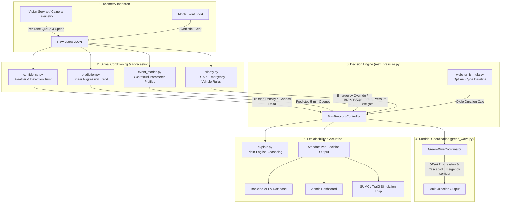
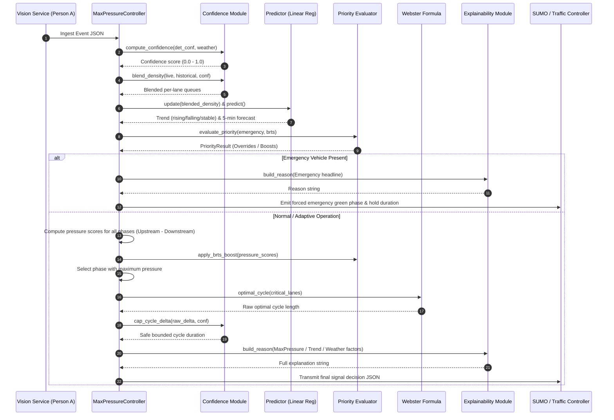

# E-Rakshak: Signal Optimizer Engine

The **Signal Optimizer** is the algorithmic decision-making brain of the **E-Rakshak** intelligent traffic management system. It dynamically controls urban traffic lights by translating real-time computer vision vehicle queue telemetry into optimal signal phase selections, green split allocations, and multi-junction green wave coordination.

---

## 1. System Overview & Architecture

Unlike traditional fixed-time controllers that cycle signals on static timers regardless of demand, the Signal Optimizer continuously evaluates intersection pressure, predicted traffic trends, sensor reliability, environmental conditions, and transit/emergency priority.



---

## 2. Core Modules Breakdown

### 2.1 [max_pressure.py](file:///c:/Users/visha/OneDrive/Desktop/E_rakshak/ERakshak/signal-optimizer/max_pressure.py) — Core Adaptive Signal Controller
The central controller ([MaxPressureController](file:///c:/Users/visha/OneDrive/Desktop/E_rakshak/ERakshak/signal-optimizer/max_pressure.py#L106-L336)) implements the network-wide **Max-Pressure (Back-Pressure)** control policy:

$$\text{Pressure}(P) = \sum_{i \in \text{Upstream}(P)} w_i \cdot Q_i - \sum_{j \in \text{Downstream}(P)} w_j \cdot Q_j$$

* **Phase Selection**: Computes the net differential between vehicles queuing to enter the intersection vs. capacity/queue in downstream receiving lanes, scaled by active mode weights. The phase maximizing net throughput is chosen.
* **Cycle Duration**: Computes theoretical minimum delay cycle time using Webster's equation, constrained between active mode boundaries ($\text{min\_green} \le C \le \text{max\_green}$).
* **Decision Lifecycle**: Executes the 9-step decision pipeline on each iteration of [decide()](file:///c:/Users/visha/OneDrive/Desktop/E_rakshak/ERakshak/signal-optimizer/max_pressure.py#L125-L298).

---

### 2.2 [webster_formula.py](file:///c:/Users/visha/OneDrive/Desktop/E_rakshak/ERakshak/signal-optimizer/webster_formula.py) — Webster's Delay-Minimization Model
Provides the analytical benchmark and numeric backbone for cycle length computation using F.V. Webster's (1958) formula:

$$C_{\text{opt}} = \frac{1.5 L + 5}{1 - Y}$$

Where:
* $L = \sum l_i$: Total lost time across all phases per cycle (inter-green + clearance times, default $4.0\text{ s}$ per phase).
* $Y = \sum y_i = \sum \frac{v_i}{s_i}$: Sum of critical lane flow ratios (flow rate $v_i$ divided by saturation flow $s_i = 1800\text{ veh/h}$).
* Functions:
  * [optimal_cycle()](file:///c:/Users/visha/OneDrive/Desktop/E_rakshak/ERakshak/signal-optimizer/webster_formula.py#L52-L80): Calculates optimal cycle duration clamped to $[20\text{ s}, 180\text{ s}]$.
  * [split_green_times()](file:///c:/Users/visha/OneDrive/Desktop/E_rakshak/ERakshak/signal-optimizer/webster_formula.py#L82-L117): Allocates effective green time $g_i = \frac{y_i}{Y} (C - L)$ proportionally across phases.

---

### 2.3 [confidence.py](file:///c:/Users/visha/OneDrive/Desktop/E_rakshak/ERakshak/signal-optimizer/confidence.py) — Sensor Confidence & Weather Awareness
Prevents sensor noise, camera occlusion, lens flare, fog, or heavy rain from causing erratic signal thrashing:

1. **Confidence Score Calculation** ([compute_confidence](file:///c:/Users/visha/OneDrive/Desktop/E_rakshak/ERakshak/signal-optimizer/confidence.py#L44-L66)):
   $$\text{Confidence} = \text{clamp}_{[0, 1]}(\text{detection\_confidence} \times \text{multiplier}_{\text{weather}})$$
   * Weather Multipliers: `clear`: $1.0$, `cloudy`: $0.95$, `rain`: $0.75$, `glare`: $0.70$, `fog`: $0.65$, `snow`: $0.60$, `night`: $0.80$.
2. **Historical Blending** ([blend_density](file:///c:/Users/visha/OneDrive/Desktop/E_rakshak/ERakshak/signal-optimizer/confidence.py#L68-L95)):
   $$Q_{\text{blended}} = \text{Confidence} \cdot Q_{\text{live}} + (1 - \text{Confidence}) \cdot Q_{\text{historical}}$$
3. **Cycle Delta Clamping** ([cap_cycle_delta](file:///c:/Users/visha/OneDrive/Desktop/E_rakshak/ERakshak/signal-optimizer/confidence.py#L97-L123)):
   * When $\text{Confidence} < 0.60$, cycle time changes between consecutive steps are strictly capped at $\pm 8\text{ s}$.

---

### 2.4 [prediction.py](file:///c:/Users/visha/OneDrive/Desktop/E_rakshak/ERakshak/signal-optimizer/prediction.py) — Short-Horizon Congestion Forecasting
Enables proactive traffic management before intersections experience physical gridlock:

* **Rolling Window Linear Regression** ([LanePredictor](file:///c:/Users/visha/OneDrive/Desktop/E_rakshak/ERakshak/signal-optimizer/prediction.py#L44-L93)): Maintains the last $10$ queue measurements ($\sim 5\text{ minutes}$) and fits a degree-1 polynomial $y = m x + c$ via `numpy.polyfit`.
* **Trend Classification**:
  * **Rising**: Slope $m > +0.5\text{ veh/sample}$.
  * **Falling**: Slope $m < -0.5\text{ veh/sample}$.
  * **Stable**: $-0.5 \le m \le +0.5\text{ veh/sample}$.
* **Extrapolation**: Proactively projects queue $10$ samples ahead ($Q_{\text{pred}} = \max(0, c + m(n - 1 + 10))$) and feeds it into the max-pressure queue estimator to extend green times early.

---

### 2.5 [event_modes.py](file:///c:/Users/visha/OneDrive/Desktop/E_rakshak/ERakshak/signal-optimizer/event_modes.py) — Context-Aware Operating Profiles
Adapts control bounds and sensitivity based on urban context without altering the underlying algorithmic codebase:

| Mode Profile | Min Green ($s$) | Max Green ($s$) | Pressure Weight | Target Scenario |
| :--- | :---: | :---: | :---: | :--- |
| **`office_hours`** | $15$ | $60$ | $1.0$ | Standard weekday commuter flow |
| **`school_hours`** | $20$ | $45$ | $0.8$ | Predictable cycles, prioritizes pedestrian clearance |
| **`weekend`** | $15$ | $50$ | $0.9$ | Relaxed off-peak and night flow |
| **`festival`** | $20$ | $90$ | $1.3$ | Heavy, irregular surges needing extended green phases |
| **`rain`** | $20$ | $55$ | $0.7$ | Cautious, stabilized control under reduced traction & visibility |

* Mode Resolution Hierarchy ([select_mode](file:///c:/Users/visha/OneDrive/Desktop/E_rakshak/ERakshak/signal-optimizer/event_modes.py#L95-L137)):
  1. External triggers (`festival_active` or severe `weather_flag`)
  2. Manual operator dashboard toggle (`manual_override`)
  3. Time-of-day / Day-of-week schedule (Morning $07:00-09:00$ & Afternoon $15:00-18:00 \to$ `school_hours`, $09:00-19:00 \to$ `office_hours`, Weekends/Nights $\to$ `weekend`)
  4. Default $\to$ `office_hours`

---

### 2.6 [priority.py](file:///c:/Users/visha/OneDrive/Desktop/E_rakshak/ERakshak/signal-optimizer/priority.py) — Transit & Emergency Preemption Hierarchy
Handles two distinct prioritization layers with a deterministic conflict resolution rule:

1. **Emergency Vehicle Priority (Hard Preemption)**:
   * Triggers when an ambulance, fire truck, or police vehicle is detected.
   * **Action**: Immediately forces an unconditional green phase for the emergency approach, holding for $\max(15\text{ s}, \frac{30\text{ m}}{v_{\text{mps}}})$.
2. **BRTS Bus Priority (Soft Pressure Biasing)**:
   * Triggers when a BRTS bus waits $> 20\text{ s}$ at the stop-line.
   * **Action**: Adds an additive bias $\Delta \text{Pressure} = \min(3.0, 0.1 \times t_{\text{wait}})$ to the approach's max-pressure score so it receives green sooner without abruptly cutting off conflicting traffic.
3. **Conflict Resolution**: Emergency **strictly outranks** BRTS. When both co-occur, emergency override executes immediately, and BRTS pressure boost is deferred to subsequent cycles.

---

### 2.7 [explain.py](file:///c:/Users/visha/OneDrive/Desktop/E_rakshak/ERakshak/signal-optimizer/explain.py) — Explainable Decision Generator
Produces human-readable, transparent audit trails directly from internal math variables for city traffic operators and dashboards:

* **Hierarchy of Explanations**:
  1. `Emergency`: *"Emergency vehicle detected on north approach; forced green corridor for 15s."*
  2. `BRTS`: *"BRTS bus priority given on east approach (pressure boosted by 3.0)."*
  3. `Caution/Weather`: *"Confidence lowered to 0.58 due to rain — change capped at +8s; acting cautiously."*
  4. `Prediction`: *"Queue trend rising (predicted +8 vehicles in ~5 min on NS); green extended pre-emptively."*
  5. `Baseline Max-Pressure`: *"NS approach queue (14 vehicles) exceeds EW (5 vehicles); cycle set to 38s."*

---

### 2.8 [green_wave.py](file:///c:/Users/visha/OneDrive/Desktop/E_rakshak/ERakshak/signal-optimizer/green_wave.py) — Multi-Junction Arterial Coordination
Coordinates chains of sequential intersections along major urban corridors:

1. **Green Wave Progression Offsets**:
   Calculates coordinated phase start offsets based on inter-junction distances and design speed:
   $$\text{Offset}_{k+1} = \text{Offset}_k + \frac{d_{k, k+1}}{v_{\text{design}}}$$
2. **Emergency Corridor Cascading**:
   When an emergency vehicle is detected at junction $J_k$, the coordinator immediately signals downstream junctions ($J_{k+1}, J_{k+2}$) to prepare and pre-clear the approach before the vehicle reaches them.

---

### 2.9 [sumo/traci_runner.py](file:///c:/Users/visha/OneDrive/Desktop/E_rakshak/ERakshak/signal-optimizer/sumo/traci_runner.py) & [mock_event_feed.py](file:///c:/Users/visha/OneDrive/Desktop/E_rakshak/ERakshak/signal-optimizer/mock_event_feed.py) — Simulation & Validation Engine
* **SUMO / TraCI Mode**: Directly couples with the **SUMO** (Simulation of Urban MObility) microscopic simulation engine via TraCI socket commands ([traci.trafficlight.setPhase](file:///c:/Users/visha/OneDrive/Desktop/E_rakshak/ERakshak/signal-optimizer/sumo/traci_runner.py#L247) and [traci.trafficlight.setPhaseDuration](file:///c:/Users/visha/OneDrive/Desktop/E_rakshak/ERakshak/signal-optimizer/sumo/traci_runner.py#L248)), reading live loop detectors and testing traffic throughput.
* **Mock Standalone Mode**: Generates synthetic stream events for development, unit testing, and benchmarking without requiring local SUMO binaries installed.

---

## 3. Data Contracts

### 3.1 Input Contract (From Vision Service / Person A)
```json
{
  "junction_id": "junction_01",
  "timestamp": "2026-08-11T11:30:00Z",
  "lanes": {
    "lane_NS_1": { "density": 14, "queue_length": 11, "speed_mps": 2.1 },
    "lane_NS_2": { "density": 12, "queue_length": 9, "speed_mps": 2.4 },
    "lane_EW_1": { "density": 5,  "queue_length": 3, "speed_mps": 5.2 },
    "lane_EW_2": { "density": 4,  "queue_length": 2, "speed_mps": 5.8 }
  },
  "detection_confidence": 0.88,
  "weather_flag": "clear",
  "brts_waiting": false,
  "brts_wait_time_sec": 0,
  "brts_approach": null,
  "emergency_vehicle": {
    "detected": false,
    "approach": null,
    "lane_id": null,
    "vehicle_speed_mps": null
  },
  "brts_violation": false
}
```

### 3.2 Output Contract (To Backend API / Dashboard / Actuators)
```json
{
  "junction_id": "junction_01",
  "timestamp": "2026-08-11T11:30:00Z",
  "recommended_cycle_time_sec": 42,
  "phase": "NS_green",
  "confidence": 0.88,
  "mode": "office_hours",
  "predicted_congestion_5min": "rising",
  "brts_priority_triggered": false,
  "emergency_priority_triggered": false,
  "reason": "Queue trend rising (predicted +6 vehicles in ~5 min on NS); green extended pre-emptively."
}
```

---

## 4. Execution Flowchart



---

## 5. Simulation Validation & Benchmarks

From simulated SUMO 1-hour trials comparing the **Adaptive Max-Pressure Controller** against the baseline **Fixed-Timer Controller** ([docs/sumo_results.md](file:///c:/Users/visha/OneDrive/Desktop/E_rakshak/ERakshak/docs/sumo_results.md)):

| Scenario & Metric | Fixed-Timer Baseline | E-Rakshak Adaptive | Impact |
| :--- | :---: | :---: | :---: |
| **Normal Traffic: Average Wait Time** | $48.0\text{ s}$ | $31.2\text{ s}$ | **$-35.0\%$ delay reduction** |
| **Normal Traffic: Completed Vehicles** | $940\text{ veh}$ | $1,020\text{ veh}$ | **$+8.5\%$ throughput gain** |
| **Peak Queue Length (North-South)** | $22\text{ veh}$ | $14\text{ veh}$ | **$-36.4\%$ queue reduction** |
| **Sudden Inflow: Time to Dissipate Queue** | $62.0\text{ s}$ | $44.0\text{ s}$ | **$18\text{ s}$ faster clearance** |
| **BRTS Bus Wait at Stop-line** | $40.0\text{ s}$ | $22.0\text{ s}$ | **$-45.0\%$ bus delay reduction** |
| **Emergency Transit Time Across Corridor** | $38.0\text{ s}$ | $12.0\text{ s}$ | **$-68.4\%$ rapid transit gain** |
| **Rain / Degraded Sensors Cycle Delta** | $0\text{ s}$ (No adapt.) | $\le 8\text{ s}$ (Bounded) | **Eliminated erratic phase flips** |

---

## 6. How to Run

### Run Unit Tests & Mock Simulations
```bash
# Test mock stream across 60 decision cycles
cd ERakshak/signal-optimizer
python sumo/traci_runner.py --mock --scenario normal --steps 60

# Test congested / festival scenarios
python sumo/traci_runner.py --mock --scenario congested --steps 100
```

### Run Real SUMO TraCI Micro-Simulation
```bash
# Run headless SUMO simulation
python sumo/traci_runner.py --scenario normal

# Run with interactive GUI visualization
python sumo/traci_runner.py --gui --scenario normal
```

### Test Multi-Junction Green Wave
```bash
python green_wave.py
```
