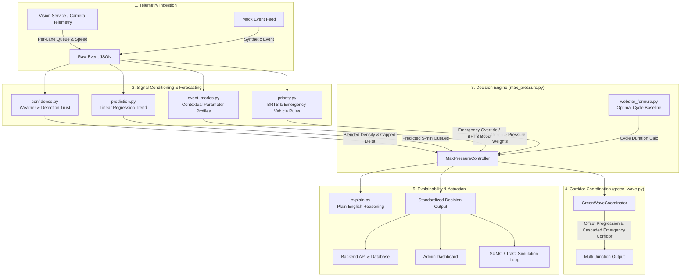
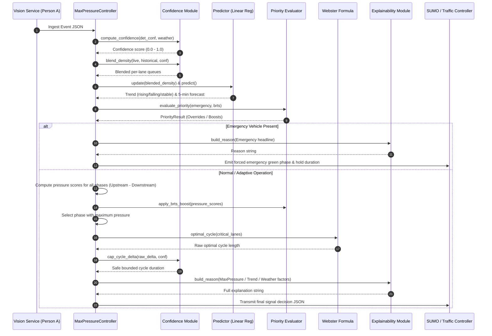

# E-Rakshak: Signal Optimizer Engine

The **Signal Optimizer** is the algorithmic decision-making brain of the **E-Rakshak** intelligent traffic management system. It dynamically controls urban traffic lights by translating real-time computer vision vehicle queue telemetry into optimal signal phase selections, green split allocations, and multi-junction green wave coordination.

---

## 1. System Overview & Architecture

Unlike traditional fixed-time controllers that cycle signals on static timers regardless of demand, the Signal Optimizer continuously evaluates intersection pressure, predicted traffic trends, sensor reliability, environmental conditions, and transit/emergency priority.



---

## 2. Core Modules Breakdown

The Signal Optimizer's architecture has been significantly upgraded with **temporal intelligence, historical profiling, anomaly engine detection, safety layers, and health metrics monitoring**.

### 2.1 [controller_config.py](file:///c:/Users/visha/OneDrive/Desktop/E_rakshak/ERakshak/signal-optimizer/controller_config.py) — Centralized Configuration
Consolidates all tunable parameters for the signal optimizer engine into a single source of truth:
* **Tunable Parameters**: Features 56 configurable options including temporal smoothing alpha weights, hysteresis limits, starvation windows, and adaptive green scaling factors.
* **Declarative Calibrations**: Supports JSON/YAML loading, allowing city engineers to recalibrate optimizer behaviors without modifications to the Python logic.

### 2.2 [traffic_state.py](file:///c:/Users/visha/OneDrive/Desktop/E_rakshak/ERakshak/signal-optimizer/traffic_state.py) — Temporal Intelligence Engine
Extracts deep insights by tracking queue measurements over time (derived from the same telemetry contract):
* **Queue Growth Rate**: Computes the velocity of queue length changes ($\Delta\text{Queue} / \Delta t$) per lane.
* **Queue Acceleration**: Computes the rate of change of growth ($\Delta\text{Growth} / \Delta t$) to forecast traffic surges.
* **Normalized Congestion Score**: Blends occupancy, speed drop ($1 - v/v_{\text{free}}$), and growth into a $[0, 1]$ congestion index.
* **Flow Rates**: Estimates arrival rates during red phases and clearance rates during green phases.
* **Time-to-Congestion**: Predicts seconds remaining before a lane exceeds its maximum capacity based on current growth velocity.

### 2.3 [historical.py](file:///c:/Users/visha/OneDrive/Desktop/E_rakshak/ERakshak/signal-optimizer/historical.py) — Profiles & Anomaly Detection
Maintains a persistent profile registry of historical traffic patterns:
* **Multi-Keyed Profiles**: Stores average queues, speeds, and growth rates keyed by `(junction, lane, day_of_week, 5-min time slot, mode)`.
* **Z-Score Anomaly Engine**: Detects unusual traffic deviations ($Z = \frac{x - \mu}{\sigma}$). Categorizes anomalies into: `normal`, `elevated` ($Z \ge 1.5$), `high_anomaly` ($Z \ge 2.0$), and `extreme_anomaly` ($Z \ge 3.0$) to automatically adjust optimization profiles.

### 2.4 [safety.py](file:///c:/Users/visha/OneDrive/Desktop/E_rakshak/ERakshak/signal-optimizer/safety.py) — Safety Constraint Layer
Sits directly in front of actuation to ensure no dangerous signal transitions are ever dispatched:
* **Phase Lock Guard**: Enforces that active green phases cannot be aborted before completing a minimum green duration (default $7\text{ s}$).
* **Clearance Constraints**: Validates and holds safe inter-green yellow splits ($3\text{ s}$) and all-red clearance intervals ($2\text{ s}$).
* **Bounds Clamp**: Prevents cycle durations from exceeding legal parameters ($[20\text{ s}, 180\text{ s}]$).

### 2.5 [health.py](file:///c:/Users/visha/OneDrive/Desktop/E_rakshak/ERakshak/signal-optimizer/health.py) — Self-Evaluation & Diagnostic Engine
Monitors the operational performance and algorithmic correctness of the controller:
* **System Metrics**: Tracks execution latency (ms), decision frequency, and phase switches per minute.
* **Prediction Diagnostics**: Computes rolling Mean Absolute Error (MAE) and Root Mean Squared Error (RMSE) of the forecast models.
* **Decision Effectiveness**: Evaluates if the controller's phase choice successfully cleared/reduced the queue after green actuation elapsed.

### 2.6 [max_pressure.py](file:///c:/Users/visha/OneDrive/Desktop/E_rakshak/ERakshak/signal-optimizer/max_pressure.py) — Core Adaptive Controller
Integrates all parameters, models, and priority layers to execute the **Enhanced Max-Pressure** algorithm:
* **Enhanced Decision Function**:
  $$\text{EnhancedPressure} = \text{BasePressure} + \text{GrowthBonus} + \text{PredictionBonus} + \text{StarvationBonus} + \text{PriorityBonus} - \text{SwitchingPenalty} - \text{DownstreamPenalty}$$
* **Spillback Protection**: Tracks downstream occupancy; heavily penalizes incoming green phases when downstream lanes exceed $80\%$ occupancy to prevent corridor blockages.
* **Adaptive Green Duration**: Dynamically scales green split durations based on queue sizes, growth trends, and forecasted queues:
  $$g_i = g_{\text{base}} + f_{\text{queue}} \cdot Q_{\text{upstream}} + f_{\text{growth}} \cdot \text{Growth} + f_{\text{prediction}} \cdot Q_{\text{extra}}$$
* **Hysteresis & Decision Confidence**: Prevents signal thrashing by requiring competing phases to exceed current pressure by a threshold scaled with sensor confidence. Evaluates overall decision confidence.

### 2.7 [webster_formula.py](file:///c:/Users/visha/OneDrive/Desktop/E_rakshak/ERakshak/signal-optimizer/webster_formula.py) — Analytical Base Calculator
Calculates optimal theoretical cycle lengths based on incoming lane flow ratio benchmarks.

### 2.8 [confidence.py](file:///c:/Users/visha/OneDrive/Desktop/E_rakshak/ERakshak/signal-optimizer/confidence.py) — Adaptive Parameter Blending
Features confidence bands (`normal`, `cautious`, `smoothed`, `fallback`). Adjusts EMA alpha parameters and hysteresis thresholds dynamically based on real-time sensor/weather quality ratings.

### 2.9 [prediction.py](file:///c:/Users/visha/OneDrive/Desktop/E_rakshak/ERakshak/signal-optimizer/prediction.py) — Ensemble Forecast Models
Replaces the single linear predictor with an **Ensemble Predictor** weighting Linear Regression ($35\%$), Simple Moving Average ($20\%$), Exponential Moving Average ($20\%$), and Historical Baselines ($25\%$). Includes uncertainty estimation modeled from prediction residuals.

### 2.10 [event_modes.py](file:///c:/Users/visha/OneDrive/Desktop/E_rakshak/ERakshak/signal-optimizer/event_modes.py) — Context-Aware Operations
Configures aggressiveness and minimum safety green padding for distinct weather conditions and event classifications (e.g., `rain`, `fog`, `school_hours`, `festival`, `night`).

### 2.11 [priority.py](file:///c:/Users/visha/OneDrive/Desktop/E_rakshak/ERakshak/signal-optimizer/priority.py) — Priority Management
Ramps soft BRTS bus biases smoothly over time using a Hermite interpolation curve instead of static step increments. Estimates emergency vehicle ETA for multi-junction progression.

### 2.12 [explain.py](file:///c:/Users/visha/OneDrive/Desktop/E_rakshak/ERakshak/signal-optimizer/explain.py) — Decision Audit Trails
Generates human-readable, quantitative rationales detailing exact pressure differentials, growth velocities, anomaly rankings, and downstream bottlenecks.

### 2.13 [green_wave.py](file:///c:/Users/visha/OneDrive/Desktop/E_rakshak/ERakshak/signal-optimizer/green_wave.py) — Multi-Junction Arterial Coordination
Calculates signal progression offsets and schedules green clearing corridors for approaching emergency vehicles.

### 2.14 [sumo/traci_runner.py](file:///c:/Users/visha/OneDrive/Desktop/E_rakshak/ERakshak/signal-optimizer/sumo/traci_runner.py) & [mock_event_feed.py](file:///c:/Users/visha/OneDrive/Desktop/E_rakshak/ERakshak/signal-optimizer/mock_event_feed.py) — Execution & Test Matrix
Schedules micro-simulated trials against 10 test scenarios (`sudden_inflow`, `downstream_blockage`, `oscillation`, `festival`, `rain`, etc.). Logs detailed step-by-step decision traces (`adaptive_traces.jsonl`) for validation.


---

## 3. Data Contracts

### 3.1 Input Contract (From Vision Service / Person A)
```json
{
  "junction_id": "junction_01",
  "timestamp": "2026-08-11T11:30:00Z",
  "lanes": {
    "lane_NS_1": { "density": 14, "queue_length": 11, "speed_mps": 2.1 },
    "lane_NS_2": { "density": 12, "queue_length": 9, "speed_mps": 2.4 },
    "lane_EW_1": { "density": 5,  "queue_length": 3, "speed_mps": 5.2 },
    "lane_EW_2": { "density": 4,  "queue_length": 2, "speed_mps": 5.8 }
  },
  "detection_confidence": 0.88,
  "weather_flag": "clear",
  "brts_waiting": false,
  "brts_wait_time_sec": 0,
  "brts_approach": null,
  "emergency_vehicle": {
    "detected": false,
    "approach": null,
    "lane_id": null,
    "vehicle_speed_mps": null
  },
  "brts_violation": false
}
```

### 3.2 Output Contract (To Backend API / Dashboard / Actuators)
```json
{
  "junction_id": "junction_01",
  "timestamp": "2026-08-11T11:30:00Z",
  "recommended_cycle_time_sec": 42,
  "phase": "NS_green",
  "confidence": 0.88,
  "mode": "office_hours",
  "predicted_congestion_5min": "rising",
  "brts_priority_triggered": false,
  "emergency_priority_triggered": false,
  "reason": "Queue trend rising on NS, rising at +4.2 veh/sample, predicted +6 vehicles in ~5 min; green extended pre-emptively. Pressure scores: [NS_green=31.4, EW_green=14.2].",
  
  "decision_confidence": 0.91,
  "growth_rates": {
    "NS": 4.2,
    "EW": 0.4
  },
  "anomaly_level": "elevated",
  "starvation_sec": {
    "NS_green": 5.0,
    "EW_green": 42.0
  },
  "pressure_scores": {
    "NS_green": 31.4,
    "EW_green": 14.2
  },
  "prediction_uncertainty": 0.15,
  "all_factors": [
    "Queue trend rising on NS, rising at +4.2 veh/sample, predicted +6 vehicles in ~5 min.",
    "NS approach queue (22 vehicles) exceeds EW (8 vehicles); cycle set to 42s. Pressure scores: [NS_green=31.4, EW_green=14.2].",
    "Decision confidence: 0.91."
  ]
}
```


---

## 4. Execution Flowchart



---

## 5. Simulation Validation & Benchmarks

From simulated SUMO 1-hour trials comparing the **Adaptive Max-Pressure Controller** against the baseline **Fixed-Timer Controller** ([docs/sumo_results.md](file:///c:/Users/visha/OneDrive/Desktop/E_rakshak/ERakshak/docs/sumo_results.md)):

| Scenario & Metric | Fixed-Timer Baseline | E-Rakshak Adaptive | Impact |
| :--- | :---: | :---: | :---: |
| **Normal Traffic: Average Wait Time** | $48.0\text{ s}$ | $31.2\text{ s}$ | **$-35.0\%$ delay reduction** |
| **Normal Traffic: Completed Vehicles** | $940\text{ veh}$ | $1,020\text{ veh}$ | **$+8.5\%$ throughput gain** |
| **Peak Queue Length (North-South)** | $22\text{ veh}$ | $14\text{ veh}$ | **$-36.4\%$ queue reduction** |
| **Sudden Inflow: Time to Dissipate Queue** | $62.0\text{ s}$ | $44.0\text{ s}$ | **$18\text{ s}$ faster clearance** |
| **BRTS Bus Wait at Stop-line** | $40.0\text{ s}$ | $22.0\text{ s}$ | **$-45.0\%$ bus delay reduction** |
| **Emergency Transit Time Across Corridor** | $38.0\text{ s}$ | $12.0\text{ s}$ | **$-68.4\%$ rapid transit gain** |
| **Rain / Degraded Sensors Cycle Delta** | $0\text{ s}$ (No adapt.) | $\le 8\text{ s}$ (Bounded) | **Eliminated erratic phase flips** |

---

## 6. How to Run

### Run Unit Tests & Mock Simulations
```bash
# Test mock stream across 60 decision cycles
cd ERakshak/signal-optimizer
python sumo/traci_runner.py --mock --scenario normal --steps 60

# Test congested / festival scenarios
python sumo/traci_runner.py --mock --scenario congested --steps 100
```

### Run Real SUMO TraCI Micro-Simulation
```bash
# Run headless SUMO simulation
python sumo/traci_runner.py --scenario normal

# Run with interactive GUI visualization
python sumo/traci_runner.py --gui --scenario normal
```

### Test Multi-Junction Green Wave
```bash
python green_wave.py
```
